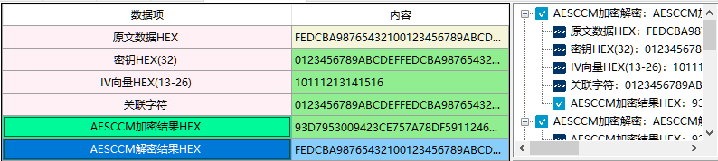

# AESCCM加密解密

1、CCM是Cipher Block Chaining Message Authentication Code (CBC-MAC)和Counter模式（CTR）的组合。可以同时生存认证信息和对数据加密。CCM广泛用于互联网和物联网中对传输数据进行保护，比如WiFi安全中的WPE协议，它就使用了AES-CCM模式。

2、相关资料

资料参考 rfc3610

3、输入参数要求

| 数据项            | 输入参数要求                                                 |
| ----------------- | ------------------------------------------------------------ |
| 原文数据HEX       | 输入需要加密的原文数据，格式为HEX格式，可以为空              |
| 密钥HEX(32)       | 密钥的长度是32个 密钥是一种参数，它是在明文转换为密文或将密文转换为明文的算法中输入的参数。 |
| IV向量HEX(13-26)  | IV格式为HEX格式，长度最少14个最大不超过26个。 IV本质上是一个noce，即在指定上下文中唯一的一个值。 在密码学的领域里，初始向量（英语：initialization vector，缩写为IV），或译初向量， 又称初始变量（starting variable，缩写为SV)，是一个固定长度的输入值。一般的使用上会要求它是随机数 或伪随机数（pseudorandom）。使用随机数产生的初始向量才能达到语义安全（消息验证码也可能用到 初始向量），并让攻击者难以对原文一致且使用同一把密钥生成的密文进行破解。在区块加密中，使用了 初始向量的加密模式被称为区块加密模式。 |
| 关联字符          | 关联字符格式为HEX格式，可以为空，最大长度小于264>个，这些关联字符经过身份验证但未加密，并且不包括在此模式的输出中。它可用于验证明文数据包报头或影响消息解释的上下文信息。 |
| AESCCM加密结果HEX | AESCCM将数据加密后的结果，格式为HEX格式                      |
| AESCCM解密结果HEX | AESCCM将数据解密后的原文，格式为HEX格式                      |

4、功能演示

| 数据项            | 测试参数内容                                                 |
| ----------------- | ------------------------------------------------------------ |
| 原文数据HEX       | FEDCBA98765432100123456789ABCDEF                             |
| 密钥HEX(32)       | 0123456789ABCDEFFEDCBA9876543210                             |
| IV向量HEX(13-26)  | 10111213141516                                               |
| 关联字符          | 0123456789ABCDEFFEDCBA9876543210                             |
| AESCCM加密结果HEX | 93D7953009423CE757A78DF5911246B451D0454C82B1109CAFDE0DE2A3345A4F |

根据上述测试数据，点击商用密码应用与检测工具箱中“AESCCM加密结果HEX”、 “AESCCM解密结果HEX”按钮，会计算出相应结果，同时右侧会显示出该过程的输入输出参数及计算结果，可见下图所示：

