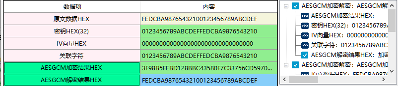

# AESGCM加密解密

1、伽罗瓦/计数器模式(GCM)是一种对数据的加密鉴别模式,GCM使用了加密的计数器运算模式来确保数据的机密性,并且通过使用有限域上的通用的杂凑函数来保证机密数据的完整性。GCM对于无需加密的附加数据提供了认证,确保其没有被修改。
       如果GCM的输人被限制为没有加密的数据,那么GCM的输出结果可被称为GMAC,GMAC是对输入的数据提供可鉴别模式。
       GCM有两个相关函数分别被称为鉴别加密和鉴别解密,每一个函数都相对高效的,并且能够并行化的处理。

2、相关资料

3、输入参数要求

| 数据项            | 输入参数要求                                                 |
| ----------------- | ------------------------------------------------------------ |
| 原文数据HEX       | 输入需要加密的原文数据，格式为HEX格式，最大长度不超过237>-64个。  明文和附加的可鉴别数据是GCM保护的两类数据。GCM保护明文和附加的可鉴别数据的真实性;GCM 也保护明文的机密性,而附加的可鉴别数据则被保留是明文的。 |
| 密钥HEX(32)       | 密钥的长度是32个 密钥是一种参数，它是在明文转换为密文或将密文转换为明文的算法中输入的参数。 |
| IV向量HEX         | IV格式为HEX格式，长度最少14个最大不超过26个。 IV本质上是一个noce，即在指定上下文中唯一的一个值。 在密码学的领域里，初始向量（英语：initialization vector，缩写为IV），或译初向量， 又称初始变量（starting variable，缩写为SV)，是一个固定长度的输入值。一般的使用上会要求它是随机数 或伪随机数（pseudorandom）。使用随机数产生的初始向量才能达到语义安全（消息验证码也可能用到 初始向量），并让攻击者难以对原文一致且使用同一把密钥生成的密文进行破解。在区块加密中，使用了 初始向量的加密模式被称为区块加密模式。 |
| 关联字符          | 关联字符格式为HEX格式，可以为空，最大长度不超过262>-1个，明文和关联字符是GCM保护的两类数据。 GCM保护明文和关联字符的真实性;GCM 也保护明文的机密性,而关联字符则被保留是明文的。 例如 :在网络协议中,关联字符可以包括地址、端口、序列号,协议版本号,以及说明如何处理明文的其他字段。 |
| AESGCM加密结果HEX | AESGCM将数据加密后的结果，格式为HEX格式                      |
| AESGCM解密结果HEX | AESGCM将数据解密后的原文，格式为HEX格式                      |

4、功能演示

| 数据项            | 测试参数内容                                                 |
| ----------------- | ------------------------------------------------------------ |
| 原文数据HEX       | FEDCBA98765432100123456789ABCDEF                             |
| 密钥HEX(32)       | 0123456789ABCDEFFEDCBA9876543210                             |
| IV向量HEX         | 00000000000000000000000000000000                             |
| 关联字符          | 0123456789ABCDEFFEDCBA9876543210                             |
| AESCCM加密结果HEX | 3F98B5FEBD128BBC43580F7C33756CD5970ABEBC9B42E8804D2BE482AA887529 |

根据上述测试数据，点击商用密码应用与检测工具箱中“AESGCM加密结果HEX”、 “AESGCM解密结果HEX”按钮，会计算出相应结果，同时右侧会显示出该过程的输入输出参数及计算结果，可见下图所示：

