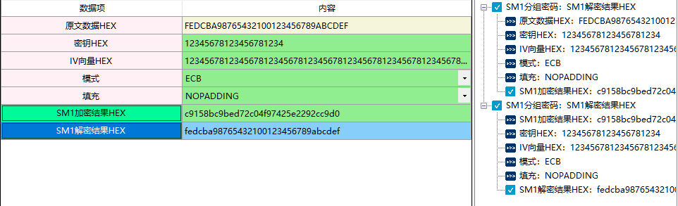

# 国密算法：SM1分组密码算法

1、SM1 算法是分组密码算法，分组长度为128位，密钥长度都为 128 比特，算法安全保密强度及相关软硬件实现性能与 AES 相当，算法不公开，仅以IP核的形式存在于芯片中。采用该算法已经研制了系列芯片、智能IC卡、智能密码钥匙、加密卡、加密机等安全产品，广泛应用于电子政务、电子商务及国民经济的各个应用领域（包括国家政务通、警务通等重要领域）。

在商用密码应用与检测工具箱中SM1分组密码算法包含了SM1分组密码、SM1加密解密、SM1对称算法三种，输入参数要求及功能演示请参考以下部分。

该算法使用需要连接硬件key。

2、相关资料：

 算法不公开，仅以IP核的形式存在于芯片中。

3、输入参数要求

| 数据项         | 输入参数要求                                                 |
| -------------- | ------------------------------------------------------------ |
| 原文数据HEX    | 输入您需要加密的数据，格式为HEX格式，字符串组成为0-9,A-F，并且长度为偶数，填充和模式各种组合情况对原文数据长度的要求详见 注释1 |
| 密钥HEX        | 密钥格式为HEX格式，长度不限，程序内部会自动补0，将密钥填充至长度为32个的密钥，超出部分则截去 |
| IV向量HEX      | 向量长度最少为64个的hex字符串                                |
| 模式           | 支持 ECB（电子密码本模式）/CBC模式（密码分组链接模式）/    CFB模式 (密文反馈模式）/OFB模式（输出反馈模式）四种模式，四种模式介绍详见 注释2 |
| 填充           | NOPadding：不填充。 PKCS5Padding：填充至符合块大小的整数倍，填充值为填充数量数，PKCS5Padding的块大小应为8个字节。 |
| SM1加密结果HEX | SM1加密结果，格式为HEX格式，当填充方式选择NOPADDING时加密结果长度与明文长度相同,当填充选择PKCS5后，密文长度是32的倍数 |
| SM1解密结果HEX | SM1解密结果，格式为HEX                                       |

** 注释1：**

明文格式为HEX格式
    以下是填充和模式各种组合情况对原文数据长度的要求，
    以下要求是可以加密出结果的最低要求。
例如
    表格中提到32的倍数 表示 原文数据长度为32的倍数
    >=2表示 长度至少为2个 如：输入“AB”就是两个
    X表示不能这样组合使用
    表格中只写了数字 32 表示固定长度 只能为32个
    同时出现>=x和<=y表示 最小长度为x最大长度y

<table>
       <tr>
           <td rowspan="2">填充</td>
           <td colspan="4" align="center">模式</td>
       </tr>
        <tr>   
              <td>ECB</td>
              <td>CBC</td>
              <td>CFB</td>
              <td>OFB</td>
        </tr>
        <tr>
              <td>NOPADDING</td>
              <td>32</td>
              <td>32</td>
              <td>>=2</td>
              <td>>=2</td>
        </tr>
        <tr>
              <td>PKCS5</td>
              <td>无限制</td>
              <td>无限制</td>
              <td>无限制</td>
              <td>无限制</td>
        </tr>
</table>

** 注释2：**

SM1使用的分组加密模式 
    ECB（电子密码本模式）：处理定长的数据，如AES处理128bit，那么将明文切分成若干个128bit，分别加密。这种模式就是ECB模式，实际上有很明显的弱点，现在已经不被使用。
    CBC模式（密码分组链接模式）：CBC模式由IBM发明与1976年，在CBC模式中，每个平文块先与前一个密文块进行异或后，再进行加密。在这种方法中，每个密文块都依赖于它前面的所有密文块。同时，为了保证每条消息的唯一性，在第一个块中需要使用初始化向量。
    CFB模式 (密文反馈模式）：CFB又称密文反馈模式，前一个密文分组会被送入密码算法的输入端，再将输出的结果与明文做异或。与ECB和CBC模式只能够加密块数据不同，CFB能够将块密文（Block Cipher）转换为流密文。
    OFB模式（输出反馈模式）：OFB又称输出反馈模式，前一组密码算法输出会输入到下一组密码算法输入。先用块加密器生成密钥流，然后再将密钥流与明文流异或得到密文流，解密是先用块加密器生成密钥流，再将密钥流与密文流异或得到明文，由于异或操作的对称性所以加密和解密的流程是完全一样的。

4、功能演示、

| 数据项      | 测试参数内容                                                 |
| ----------- | ------------------------------------------------------------ |
| 原文数据HEX | FEDCBA98765432100123456789ABCDEF                             |
| 密钥HEX     | 12345678123456781234                                         |
| IV向量HEX   | 1234567812345678123456781234567812345678123456781234567812345678 |
| 模式        | ECB                                                          |
| 填充        | NOPADDING                                                    |

根据上述测试数据，点击商用密码应用与检测工具箱中“SM1加密结果HEX”、 “SM1解密结果HEX”按钮，会计算出相应结果，同时右侧会显示出该过程的输入输出参数及计算结果，可见下图所示：

