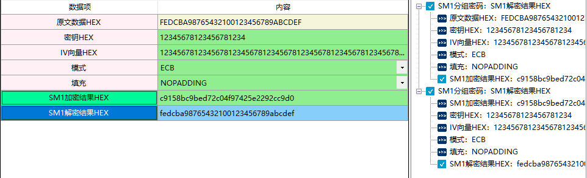

# 国密算法：SM1分组密码算法

​        SM1 算法是分组密码算法，分组长度为128位，密钥长度都为 128 比特，算法安全保密强度及相关软硬件实现性能与 AES 相当，算法不公开，仅以IP核的形式存在于芯片中。

​        采用该算法已经研制了系列芯片、智能IC卡、智能密码钥匙、加密卡、加密机等安全产品，广泛应用于电子政务、电子商务及国民经济的各个应用领域（包括国家政务通、警务通等重要领域）。该算法使用需要连接硬件key。

## 一、SM1分组密码

1、定义

2、相关资料

3、输入参数要求

| 数据项         | 输入参数要求 |
| -------------- | ------------ |
| 原文数据HEX    |              |
| 密钥HEX        |              |
| IV向量HEX      |              |
| 模式           |              |
| 填充           |              |
| SM1加密结果HEX |              |
| SM1解密结果HEX |              |

4、功能演示、

| 数据项      | 测试参数内容                                                 |
| ----------- | ------------------------------------------------------------ |
| 原文数据HEX | FEDCBA98765432100123456789ABCDEF                             |
| 密钥HEX     | 12345678123456781234                                         |
| IV向量HEX   | 1234567812345678123456781234567812345678123456781234567812345678 |
| 模式        | ECB                                                          |
| 填充        | NOPADDING                                                    |

根据上述测试数据，点击商用密码应用与检测工具箱中“SM1加密结果HEX”、 “SM1解密结果HEX”按钮，会计算出相应结果，同时右侧会显示出该过程的输入输出参数及计算结果，可见下图所示：

## 二、SM1加密解密

1、定义

2、相关资料

3、输入参数要求及功能演示可参考SM1分组密码部分

## 三、SM1对称算法

1、定义

2、相关资料

3、输入参数要求及功能演示可参考SM1分组密码部分

