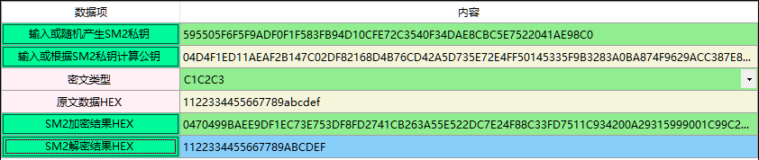
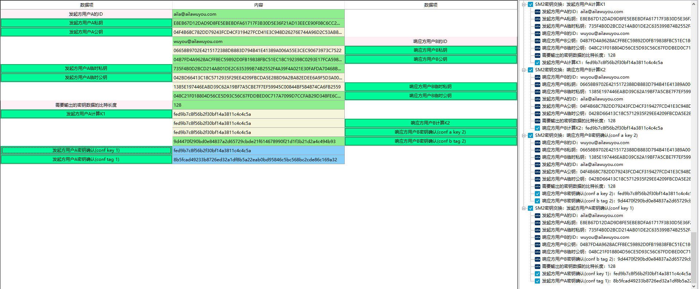
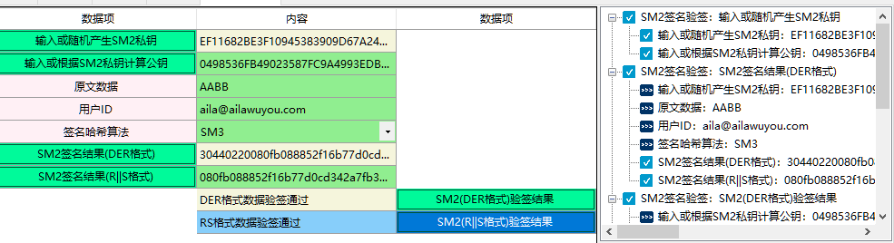
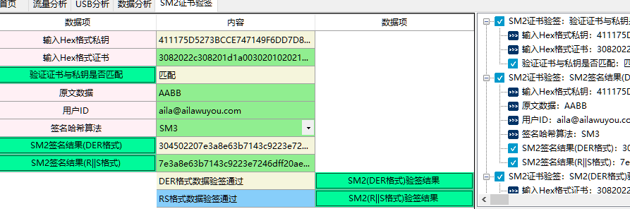
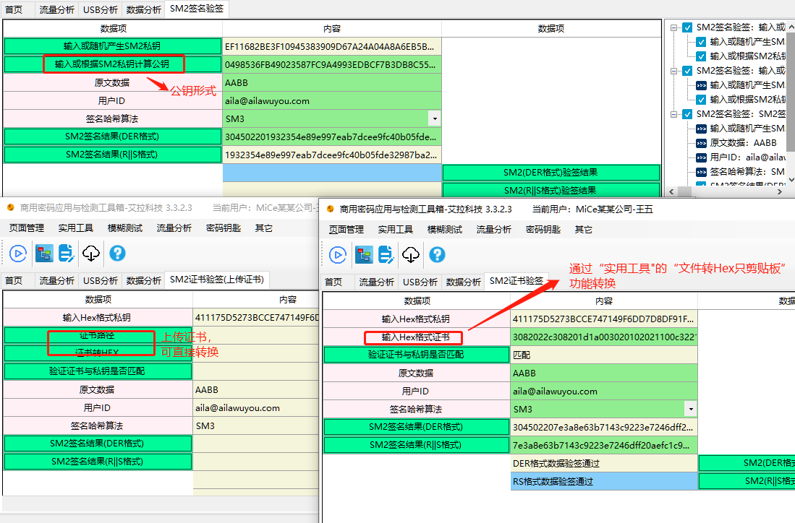
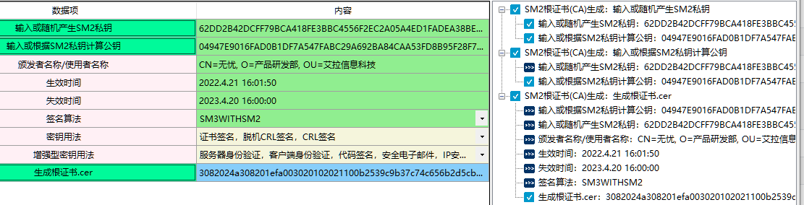

# 国密算法：SM2椭圆曲线公钥算法

SM2是中华人民共和国政府采用的一种公开密钥加密标准，由国家密码管理局于2010年12月17日发布，相关标准为“GM/T 0003-2012 《SM2椭圆曲线公钥密码算法》。2016年，成为中国国家密码标准（GB/T 32918-2016）。

在商用密码体系中，SM2主要用于替换RSA加密算法。SM2与RSA算法相比：加密强度更高、安全性能更强、传输速度更快。

详细介绍请参考：商用密码应用与检测工具箱客户端-帮助-（待确认，后续确定后再填写）

## 一、SM2加密解密

1、SM2加密解密算法使用与国家商用密码应用中的消息加解密，消息发送者可以利用接收者的公钥对消息进行加密，接收者用对应的私钥进行解密，获取消息。同时SM2加密解密算法还可为安全产品生产商提供产品和技术的标准定位以及标准化的参考，提高安全产品的可信性与互操作性。

2、相关资料

《GMT 0003.1-2012 SM2椭圆曲线公钥密码算法第1部分：总则》

《GMT 0003.4-2012 SM2椭圆曲线公钥密码算法第4部分：公钥加密算法》

《GMT 0003.5-2012 SM2椭圆曲线公钥密码算法第5部分：参数定义》

《GMT 0009-2012 SM2密码算法使用规范 》

3、输入参数的要求

| 数据项                    | 输入参数要求                                                 |
| :------------------------ | :----------------------------------------------------------- |
| 输入或随机产生SM2私钥     | SM2私钥为HEX格式 SM2私钥是一个大于等于1且小于n-1的整数 （n=FFFFFFFE FFFFFFFF FFFFFFFF FFFFFFFF FFFFFFFF 00000000 FFFFFFFF FFFFFFFC），长度为64个。 |
| 输入或根据SM2私钥计算公钥 | SM2的公钥格式为HEX格式可通过私钥计算得到，也可以手动输入。 SM2公钥是SM2曲线上的一个点，由横坐标和纵坐标两个分量来表示，记为（x，y），简记为Q， 每个分量的长度为64个，总长度为128个。 04开头则总长变为130个，04代表非压缩。 |
| 密文类型                  | 密文类型表示输出结果的不同格式 SM2非对称加密的结果由C1,C2,C3三部分组成。 其中C1是生成随机数的计算出的椭圆曲线点，C2是密文数据，C3是SM3的摘要值。 最开始的国密标准的结果是按C1C2C3顺序的，新标准的是按C1C3C2顺序组成的， 因此本脚本包含了这两个格式格式C1C2C3、C1C3C2，除了这两种标准格式外还支持ASN1格式。 |
| 原文数据HEX               | 输入您需要加密的数据，格式为HEX格式，字符串组成为0-9,A-F，并且长度为偶数 |
| SM2加密结果HEX            | SM2加密结果为Hex格式 如果密文类型选择C1C2C3或C1C3C2则：SM2加密后的密文长度比明文长度增加了194（2长度的04标识 + 128长度的c1 +64长度的c3） 也就是 SM2加密结果长度=原文长度+194 如果选择ASN1格式 结果总是以30开头。 |
| SM2解密结果HEX            | SM2解密是指使用指定的私钥对密文进行解密计算，还原对应明文的过程。 解密结果为HEX格式。 |

4、功能演示

| 数据项                    | 测试参数内容                                                 |
| :------------------------ | :----------------------------------------------------------- |
| 输入或随机产生SM2私钥     | 595505F6F5F9ADF0F1F583FB94D10CFE72C3540F34DAE8CBC5E7522041AE98C0 |
| 输入或根据SM2私钥计算公钥 | 04D4F1ED11AEAF2B147C02DF82168D4B76CD42A5D735E72E4FF50145335F9B3283A0B A874F9629ACC387E840C55E6AFA9E10B1A5A8397C25A202BB5ACBD2A195B9 |
| 密文类型                  | C1C2C3                                                       |
| 原文数据HEX               | 1122334455667789abcdefz                                      |

注：当测试参数内容在上述表格中显示是两行或者两行以上，可能会含有换行符，建议复制到txt文档或word文档中取消换行 ，否则会出现报错。

根据上述测试数据，点击商用密码应用与检测工具箱中“SM2加密结果HEX”、 “SM2解密结果HEX”按钮，操作结果如下图所示：

当左侧进行操作，右侧会记录该过程的输入输出参数及计算结果，如下图所示：

5、商用密码应用与检测工具箱中的“SM2随机生成公私钥”、“SM2根据私钥计算公钥”、“SM2非对称算法”介绍可参考本章节。

## 二、SM2密钥交换

1、SM2密钥交换算法适用于商用密码应用中的密钥交换,可满足通信双方经过两次或可选三次信息传递过程,计算获取一个由双方共同决定的共享秘密密钥(会话密钥)。同时,本部分还可为安全产品生产商提供产品和技术的标准定位以及标准化的参考,提高安全产品的可信性与互操作性。SM2密钥协商是在两个用户之间建立一个共享秘密密钥的协商过程，通过这种方式能够确定一个共享秘密密钥的值。

2、相关资料

《GMT 0003.3-2012 SM2椭圆曲线公钥密码算法第3部分：密钥交换协议》

《GMT 0009-2012 SM2密码算法使用规范 》

3、输入参数要求

| 数据项                       | 输入参数要求                                                 |
| ---------------------------- | ------------------------------------------------------------ |
| 发起方用户A的ID              | 用户ID为任意长度的UTF-8随机字符串                            |
| 发起方用户A私钥              | 用户A的SM2私钥，格式为HEX格式 SM2私钥是一个大于等于1且小于n-1的整数 （n=FFFFFFFE FFFFFFFF FFFFFFFF FFFFFFFF FFFFFFFF 00000000 FFFFFFFF FFFFFFFC），长度为64个。 |
| 发起方用户A公钥              | 用户A的SM2公钥格式为HEX格式 SM2公钥是SM2曲线上的一个点，由横坐标和纵坐标两个分量来表示，记为（x，y），简记为Q， 每个分量的长度为64个，总长度为128个。04开头则总长变为130个，04代表非压缩 |
| 发起方用户A临时私钥          | 与“发起方用户A私钥”要求相同                                  |
| 发起方用户A临时公钥          | 与“发起方用户A私钥”要求相同                                  |
| 需要输出的密钥数据的比特长度 | 需要输出的密钥比特长度：要求输入的数为正整数。               |
| 响应方用户B的ID              | 与“发起方用户A的ID”                                          |
| 响应方用户B私钥              | 与“发起方用户A私钥”要求相同                                  |
| 响应方用户B公钥              | 与“发起方用户A私钥”要求相同                                  |
| 响应方用户B临时私钥          | 与“发起方用户A私钥”要求相同                                  |
| 响应方用户B临时公钥          | 与“发起方用户A私钥”要求相同                                  |
| 发起方用户A计算K1            | 计算共享秘密密钥，结果为HEX格式                              |
| 响应方用户B计算K2            | 计算共享秘密密钥，结果为HEX格式                              |

4、功能演示

| 数据项                       | 测试参数内容                                                 |
| ---------------------------- | ------------------------------------------------------------ |
| 发起方用户A的ID              | aila@ailawuyou.com                                           |
| 发起方用户A私钥              | E8EB67D12DAD9D8FE5EBEBDFA61717F3B30D5E36F21AD13EECE90F08C6CC2C2A |
| 发起方用户A公钥              | 04F4B68C782DD79243FCD4CF319427FCD41E3C948D26276E744A96D2C53AB8EF03B75BDB FBC2C344B80ECCF72824C26C0EF8A3940F9FC34EA66FC0163B25F2D5D0 |
| 响应方用户B的ID              | wuyou@ailawuyou.com                                          |
| 响应方用户B私钥              | 06658B9702E4215172388DB883D794B41E41389A006A55E3CEC90673973C7522 |
| 响应方用户B公钥              | 04B7FD4A9628ACFF8EC59892D0FB19838FBC51EC18C192398C0293E17FCA598FD5DE510B 1A6B69C540992505B8AE19C24FFD319DA421816EB462F03AFDC618B799 |
| 发起方用户A临时私钥          | 735F4B0D2BCD214AB01DE2C635399B74B2552F4A39F4A021E30FAFDA70468B26 |
| 发起方用户A临时公钥          | 042BD66413C18C5712935F29EE4209FBCDA5E28BD9A2BA82EDEE6A9F5D3A006FBD76C8DD3FF 82D2F0196A9EB530830E753716E418C545526203E7A6F80C7A8E371 |
| 响应方用户B临时私钥          | 1385E197446EABD39C62A19BF7A5CBE7F7EF59945C00844BF584874CA6FB2559 |
| 响应方用户B临时公钥          | 048C21F018804D56CE5D93C56C67FDDBED0C717A7099D7CCFAB29D348FE6C2D7CDF43A1AF 0680C8F8302FC131E0A97536B3F53E42A2F58EEA7E113AC2BC6EE2039 |
| 需要输出的密钥数据的比特长度 | 128                                                          |

注：当测试参数内容在上述表格中显示是两行或者两行以上，可能会含有换行符，建议复制到txt文档或word文档中取消换行 ，否则会出现报错。

根据上述测试数据，点击商用密码应用与检测工具箱中“发起方用户A计算K1”、 “响应方用户B计算K2”按钮，结果如下图所示，同时右侧会对显示操作记录、每步操作调用的参数及计算结果。

## 三、SM2签名验签

1、SM2数字签名算法适用于商用密码应用中的数字签名和验证，可满足多种密码应用中的身份认证和数据完整性、真实性的安全需求。同时,本部分还可以为安全产品生产商提供产品和技术的标准定位以及标准化的参考,提高安全产品的可信性与互操作性。

2、相关资料

《GMT 0003.2-2012 SM2椭圆曲线公钥密码算法第2部分：数字签名算法》

《GMT 0009-2012 SM2密码算法使用规范 》

《GMT 0010-2012 SM2密码算法加密签名消息语法规范》

《GMT 0029-2014 签名验签服务器技术规范》

SM2签名验签在商用密码应用与检测工具箱中分成了SM2签名验签(公钥方式)、SM2签名验签(证书方式）、SM2签名验签(上传证书）三种方式，三者的区别在于SM2签名验签(证书方式）和SM2签名验签(上传证书）不需输入SM2公钥，而是用证书取代。而SM2签名验签(证书方式）和SM2签名验签(上传证书）两者只是证书转HEX格式的方式有所差异，下面对SM2签名验签得输入参数要求及操作进行介绍。

### SM2签名验签(公钥方式)

1、输入参数要求

| 数据项                    | 输入参数要求                                                 |
| ------------------------- | ------------------------------------------------------------ |
| 输入或随机产生SM2私钥     | SM2私钥格式为HEX格式 SM2私钥是一个大于等于1且小于n-1的整数（n=FFFFFFFE FFFFFFFF FFFFFFFF FFFFFFFF FFFFFFFF 00000000 FFFFFFFF FFFFFFFC），长度为64个。 |
| 输入或根据SM2私钥计算公钥 | SM2的公钥格式为HEX格式可通过私钥计算得到，也可以手动输入。 SM2公钥是SM2曲线上的一个点，由横坐标和纵坐标两个分量来表示，记为（x，y），简记为Q，每个分量的长度为64个，总长度为128个。04开头则总长变为130个，04代表非压缩 |
| 原文数据                  | 输入您需要加密的数据，格式为HEX格式，字符串组成为0-9,A-F，并且长度为偶数 |
| 用户ID                    | 用户ID为任意长度的UTF-8随机字符串                            |
| 签名哈希算法              | SM2签名所需的哈希算法，作用就是将任意长度的信息转换成一段固定长度的字符串。 本脚本支持的哈希算法有SM3、SHA256。 |
| SM2签名结果(DER格式)      | SM2 产生的签名结果为R,S组成，R,S的长度各为64个，总长为128个，DER格式则是将结果转为符合ASN.1的编码规则的数据，格式总是以30开头。 |
| SM2签名结果(R\|\|S格式）  | SM2 加签之后产生的签名结果为R,S组成，R,S的长度各为64个，总长为128个，R\|S格式就是将两者拼接在一起表示。 |
| SM2(DER格式)验签结果      | 使用SM2公钥对DER格式的签名数据进行验签                       |
| SM2(R\|\|S格式)验签结果   | 使用SM2公钥对R\|S格式的签名数据进行验签                      |

2、功能演示

| 数据项                    | 测试参数内容                                                 |
| ------------------------- | ------------------------------------------------------------ |
| 输入或随机产生SM2私钥     | EF11682BE3F10945383909D67A24A04A8A6EB5B60240667E26B46FC3B50859DB |
| 输入或根据SM2私钥计算公钥 | 0498536FB49023587FC9A4993EDBCF7B3DB8C555FD6C1B35ED04E12B21AFD16C86113E98FB0890F6 C3ADE4049E6CD3D835D77AFDECF8AB40EFDC1AA50D62F6E8F1 |
| 原文数据                  | AABB                                                         |
| 用户ID                    | aila@ailawuyou.com                                           |
| 签名哈希算法              | SM3                                                          |

注：当测试参数内容在上述表格中显示是两行或者两行以上，可能会含有换行符，建议复制到txt文档或word文档中取消换行 ，否则会出现报错。

根据上述测试数据，点击商用密码应用与检测工具箱中“SM2签名结果(DER格式)”、“SM2签名结果（R||S格式）”，会计算出相应结果，点击“SM2(DER格式)验签结果”、“SM2（R||S格式）验签结果”按钮，会显示其验签结果。显示内容如下图所示，同时右侧会对显示操作记录、调用参数及计算结果。

### SM2签名验签(证书方式)

1.输入参数要求

| 数据项                   | 输入参数要求                                                 |
| ------------------------ | ------------------------------------------------------------ |
| 输入Hex格式私钥          | SM2私钥为HEX格式 SM2私钥是一个大于等于1且小于n-1的整数（n=FFFFFFFE FFFFFFFF FFFFFFFF FFFFFFFF FFFFFFFF 00000000 FFFFFFFF FFFFFFFC），长度为64个。 |
| 输入Hex格式证书          | 需要通过商用密码应用与检测工具箱中“实用工具"的“文件转Hex只剪贴板”功能，并将内容复制到此位置 |
| 验证证书与私钥是否匹配   | 计算按钮，计算私钥与证书是否匹配                             |
| 原文数据                 | 输入您需要加密的数据，格式为HEX格式，字符串组成为0-9,A-F，并且长度为偶数 |
| 用户ID                   | 用户ID为任意长度的随机字符串                                 |
| 签名哈希算法             | SM2签名所需的哈希算法，作用就是将任意长度的信息转换成一段固定长度的字符串。 本脚本支持的哈希算法有SM3、SHA256 |
| SM2签名结果(DER格式)     | SM2 产生的签名结果为R,S组成，R,S的长度各为64个，总长为128个，DER格式则是将结果转为符合ASN.1的编码规则的数据，30开头 |
| SM2签名结果(R\|\|S格式） | SM2 加签之后产生的签名结果为R,S组成，R,S的长度各为64个，总长为128个，R\|S格式就是将两者拼接在一起表示。 |
| SM2(DER格式)验签结果     | 使用SM2公钥对DER格式的签名数据进行验签                       |
| SM2(R\|\|S格式）验签结果 | 使用SM2公钥对R\|S格式的签名数据进行验签                      |

2、功能演示

| 数据项          | 测试参数内容                                                 |
| --------------- | :----------------------------------------------------------- |
| 输入Hex格式私钥 | 411175D5273BCCE747149F6DD7D8DF91FA5FFCD874DC6DAB24E5E5D66CAAF940 |
| 输入Hex格式证书 | 3082022c308201d1a003020102021100c32218320cc61051e69b0ee13e7837a8300c06082a811ccf5501837505003063310b30 0906035504061302434e310f300d060355040a0c06e889bee68b89310f300d06035504070c06e5bb8ae59d8a310f300d060355 04080c06e6b2b3e58c973121301f06092a864886f70d0109011612746578744061696c617775796f752e636f6d301e170d32313 03931343037323331305a170d3331303931333037323331305a3064310b300906035504061302434e31153013060355040a0c 0ce889bee68b89e7a791e68a80310f300d06035504070c06e5bb8ae59d8a310f300d06035504080c06e6b2b3e58c97311c301a 06092a864886f70d010901160d7465787440746578742e636f6d3059301306072a8648ce3d020106082a811ccf5501822d03420 004c99edc15c397cf64411c18392a7c101f313daf0c2c506fbabc8fbdc0427513d3293dff4483e33c91ec9f6f7b128591e2edb86ddf babf282accd7c79f0c9a93e8a3633061300f0603551d130101ff040530030101ff301d0603551d0e04160414f2a834c6ef564d9448 3bbf487287ae00d268e123301f0603551d23041830168014f2a834c6ef564d94483bbf487287ae00d268e123300e0603551d0f01 01ff040403020106300c06082a811ccf5501837505000347003044022021f558ba06371069eb9c17c0e2e39a8df024df52f11abe7 9c9ae33322425f50902202069d809a994ad6c79cda9907b5bce334160cfcfd2bd7ae31169ab8f2b2d5155 |
| 原文数据        | AABB                                                         |
| 用户ID          | aila@ailawuyou.com                                           |
| 签名哈希算法    | SM3                                                          |

注：当测试参数内容在上述表格中显示是两行或者两行以上，可能会含有换行符，建议复制到txt文档或word文档中取消换行 ，否则会出现报错。

根据上述测试数据，点击商用密码应用与检测工具箱中“SM2签名结果(DER格式)”、“SM2签名结果（R||S格式）”，会计算出相应结果，点击“SM2(DER格式)验签结果”、“SM2（R||S格式）验签结果”按钮，会显示其验签结果。显示内容如下图所示，同时右侧会对显示操作记录、调用参数及计算结果。

### SM2签名验签（上传证书）

SM2签名验签（上传证书）与SM2签名验签（证书方式）只是证书转HEX格式的方式有所差异，SM2签名验签（上传证书）的输入参数要求可参考上述SM2证书验签的内容。

下图为SM2签名验签(公钥方式)、SM2签名验签(证书方式）、SM2签名验签(上传证书）三者的对比图，请参考：

## 四、SM2证书生成

商用密码应用与检测工具箱中SM2证书生成包含了SM2根证书(CA)生成和SM2用户证书生成，下面对其输入参数等进行介绍。

### SM2根证书(CA)生成

1、输入参数要求

| 数据项                    | 输入参数要求                                                 |
| ------------------------- | ------------------------------------------------------------ |
| 输入或随机产生SM2私钥     | SM2私钥为HEX格式 SM2私钥是一个大于等于1且小于n-1的整数（n=FFFFFFFE FFFFFFFF FFFFFFFF FFFFFFFF FFFFFFFF 00000000 FFFFFFFF FFFFFFFC），长度为64个。 |
| 输入或根据SM2私钥计算公钥 | SM2的公钥格式为HEX格式可通过私钥计算得到，也可以手动输入。 SM2公钥是SM2曲线上的一个点，由横坐标和纵坐标两个分量来表示，记为（x，y），简记为Q，每个分量的长度为64个，总长度为128个。04开头则总长变为130个，04代表非压缩 |
| 颁发者名称/使用者名称     | 根证书的颁发者和使用者名称相同 数据输入格式为：CN=xxxx,O=xxxx, OU=xxxx,L=XXX,S=XXX,C=XXX ，其中CN、O、OU必填,其它三个可以不写 其中各字母的含义如下： CN=使用者/办法者名字；OU=组织部门名；O=组织名；L=地址；S=州名；C=城市名 |
| 生效时间                  | 设置证书的生效时间 输入参考格式： xxxx年x月x日 xxxx年x月x日 xx时 xxxx年x月x日 xx时xx分 xxxx年x月x日 xx时xx分xx秒 以上年月日均可换成 ‘. ’或‘/ ’。  时分秒可换成‘：’ |
| 失效时间                  | 同“生效时间”                                                 |
| 签名算法                  | 本脚本支持的算法有: SM3WITHSM2 SHA256WITHSM2         |
| 密钥用法                  | 证书签名 Certificate Signing 脱机CRL签名 Off line CRL Signing CRL签名  CRL Signing |
| 增强型密钥用法            | 生成的SM2根证书的增强型密钥用法： 服务器身份验证 (1.3.6.1.5.5.7.3.1) 客户端身份验证 (1.3.6.1.5.5.7.3.2) 代码签名 (1.3.6.1.5.5.7.3.3) 安全电子邮件 (1.3.6.1.5.5.7.3.4) IP 安全终端系统 (1.3.6.1.5.5.7.3.5) IP 安全隧道终止 (1.3.6.1.5.5.7.3.6) IP 安全用户 (1.3.6.1.5.5.7.3.7) OCSP 签名 (1.3.6.1.5.5.7.3.9) 智能卡登录 (1.3.6.1.4.1.311.20.2.2) 时间戳 (1.3.6.1.5.5.7.3.8) |
| 生成根证书.cer            | 生成HEX格式的SM2根证书(.cer) 如需保存则 在 实用工具->HEX转文件 将证书数据复制到里面后转存文件。注：需要自己手动加上后缀名.cer |

2、功能演示

| 数据项                    | 测试参数内容                                                 |
| ------------------------- | ------------------------------------------------------------ |
| 输入或随机产生SM2私钥     | BB2BFBF23C0B585349BDCBB746A4129B081AFA4D3BB3848E15B581C4CFEEE43F |
| 输入或根据SM2私钥计算公钥 | 04B89A5532BCB389112B9E1EB3F417E2BC800D775E715A5D54D6222861271D2AD11CE53C4B116D5 68F72EE833675D9EF5BA3AFE8359DB0B020229218D6B74104D4 |
| 颁发者名称/使用者名称     | CN=无忧, O=产品研发部, OU=艾拉信息科技                       |
| 生效时间                  | 2022.4.21 16:01:50                                           |
| 失效时间                  | 2023.4.20 16:00:00                                           |
| 签名算法                  | SM3WITHSM2                                                   |
| 密钥用法                  | 证书签名,脱机CRL签名 ,CRL签名                                |
| 增强型密钥用法            | 服务器身份验证,客户端身份验证,代码签名,安全电子邮件,IP 安全终端系统,IP 安全隧道终止,IP 安全用户 ,OCSP 签名,智能卡登录,时间戳 |

注：当测试参数内容在上述表格中显示是两行或者两行以上，可能会含有换行符，建议复制到txt文档或word文档中取消换行 ，否则会出现报错。

根据上述测试数据，点击商用密码应用与检测工具箱中“生产根证书.cer”则会生成HEX格式的SM2根证书。同时右侧显示计算结果及调用参数。详见下图：

### SM2用户证书生成

1、输入参数要求

| 数据项                        | 输入参数要求                                                 |
| ----------------------------- | ------------------------------------------------------------ |
| 输入或随机产生SM2父类私钥     | SM2私钥为HEX格式 SM2私钥是一个大于等于1且小于n-1的整数（n=FFFFFFFE FFFFFFFF FFFFFFFF FFFFFFFF FFFFFFFF 00000000 FFFFFFFF FFFFFFFC），长度为64个。 |
| 输入或根据SM2私钥计算父类公钥 | SM2公钥格式为HEX格式可通过私钥计算得到，也可以手动输入。 SM2公钥是SM2曲线上的一个点，由横坐标和纵坐标两个分量来表示，记为（x，y），简记为Q，每个分量的长度为64个，总长度为128个。04开头则总长变为130个，04代表非压缩 |
| 输入或随机产生SM2子类私钥     | 同“输入或随机产生SM2父类私钥”                                |
| 输入或根据SM2私钥计算子类公钥 | 同“输入或根据SM2私钥计算父类公钥”                            |
| 颁发者名称                    | 数据输入格式为：CN=xxxx,O=xxxx, OU=xxxx,L=XXX,S=XXX,C=XXX ，其中CN、O、OU必填,其它三个可以不写 其中各字母的含义如下： CN=使用者/办法者名字；OU=组织部门名；O=组织名；L=地址；S=州名；C=城市名 |
| 使用者名称                    | 同“颁发者名称”                                               |
| 生效时间                      | 输入参考格式： xxxx年x月x日 xxxx年x月x日 xx时 xxxx年x月x日 xx时xx分 xxxx年x月x日 xx时xx分xx秒 以上年月日均可换成 ‘. ’或‘/ ’。  时分秒可换成‘：’ |
| 失效时间                      | 同“生效时间”                                                 |
| 签名算法                      | 本脚本支持的算法有: SM3WITHSM2 SHA256WITHSM2         |
| pfx文件密码                   | 生成证书pfx格式所需要的密码，为空则使用默认密码：123456      |
| 密钥用法                      | 数字签名 Digital Signature, 不可否认性 Non-Repudiation,  密钥协商 Key Agreement |
| 增强型密钥用法                | 生成的SM2用户证书的增强型密钥用法： 客户端身份验证 (1.3.6.1.5.5.7.3.2) 安全电子邮件 (1.3.6.1.5.5.7.3.4) |
| 生成用户证书.cer              | 生成HEX格式的SM2用户证书（.cer） 如需保存则 在 实用工具->HEX转文件 将证书数据复制到里面后转存文件。注：需要自己手动加上后缀名.cer |
| 生成用户证书.pfx              | 生成Hex格式的用户证书(.pfx) 如需保存则 在 实用工具->HEX转文件 将证书数据复制到里面后转存文件。注：需要自己手动加上后缀名.pfx |

2、功能演示

| 数据项                        | 测试参数内容                                                 |
| ----------------------------- | ------------------------------------------------------------ |
| 输入或随机产生SM2父类私钥     | F6CD403B985541F30C89958C95971C51E96A79931D7057AD01DD28BC3569CB35 |
| 输入或根据SM2私钥计算父类公钥 | 043B4E2368F7C933B7CC54D7618BD8209D1C8B7DD809CD31ED32E80324A643B1AF669ACB22669F5 6BCD1026BECCC8EA7F78D70EA2B510400F79B76135C28200FB9 |
| 输入或随机产生SM2子类私钥     | AC736DB3C400DA188493DF074424DD6B6E56E5FF1F592F58D222163A35DE5AD7 |
| 输入或根据SM2私钥计算子类公钥 | 0468642451F98E6A715C44B407578D4BEF5B0D88019567E52C8FC9322B8207F155126197899B83BB96A8EAB 12920FC751C0F48C9792CCEB0483805A74DA03387AA |
| 颁发者名称                    | CN=无忧, O=产品研发部, OU=艾拉信息科技                       |
| 使用者名称                    | CN=艾拉, O=工程部, OU=艾拉信息科技                           |
| 生效时间                      | 2022.4.21 16:01:50                                           |
| 失效时间                      | 2023.4.20 16:00:00                                           |
| 签名算法                      | SM3WITHSM2                                                   |
| pfx文件密码                   | 123456                                                       |
| 密钥用法                      | 数字签名,不可否认性,密钥协商                                 |
| 增强型密钥用法                | 客户端身份证验证,安全电子邮件                                |

注：当测试参数内容在上述表格中显示是两行或者两行以上，可能会含有换行符，建议复制到txt文档或word文档中取消换行 ，否则会出现报错。

根据上述测试数据，点击商用密码应用与检测工具箱中“生产用户证书.cer”则会生成HEX格式的SM2用户证书，如需保存则 在 实用工具->HEX转文件 将证书数据复制到里面后转存文件，需要自己手动加上后缀名.cer或后缀名.pfx。同时右侧显示计算结果及调用参数。详见下图：

