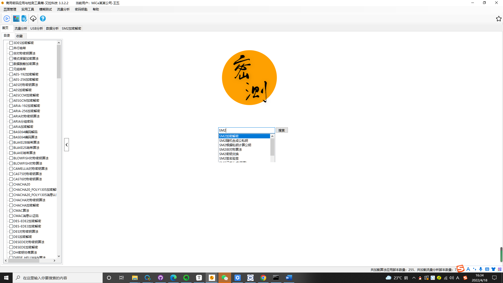
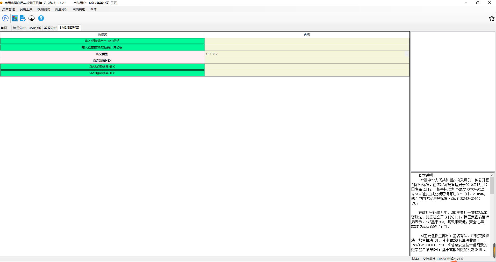
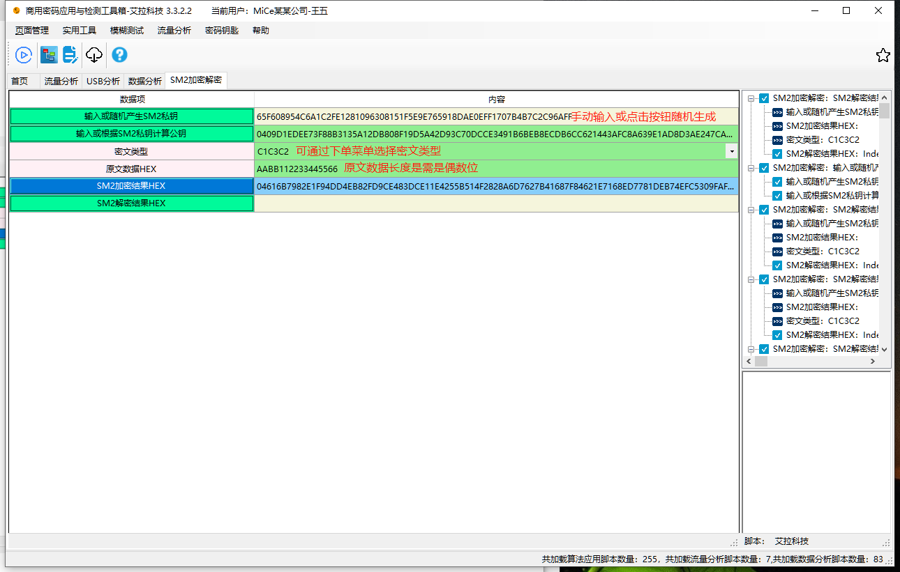
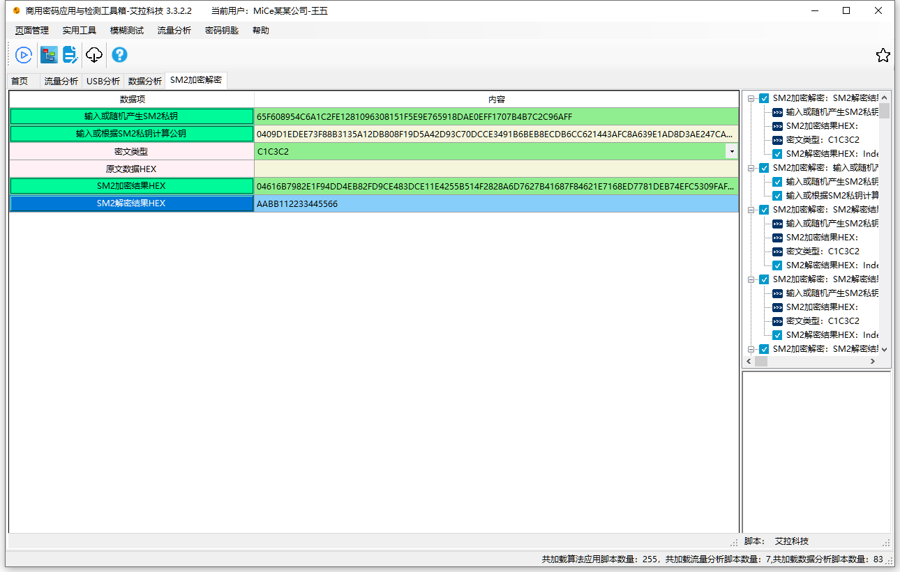
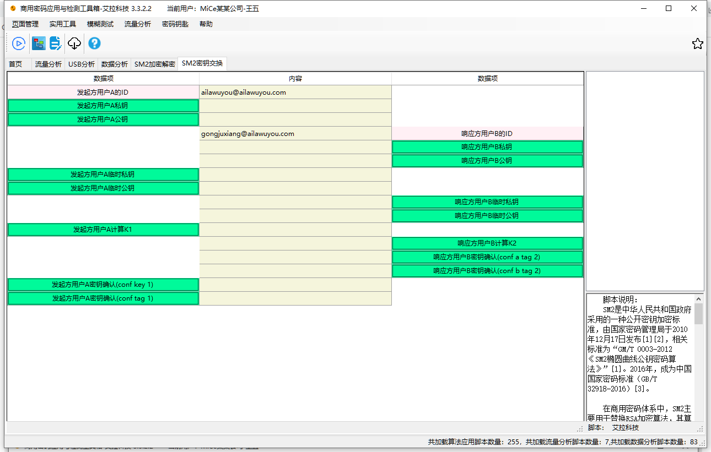

# 国密算法：SM2分组密码算法

SM2是中华人民共和国政府采用的一种公开密钥加密标准，由国家密码管理局于2010年12月17日发布[1][2]，相关标准为“GM/T 0003-2012 《SM2椭圆曲线公钥密码算法》”[1]。2016年，成为中国国家密码标准（GB/T 32918-2016）[3]。

详细介绍请参考：客户端-帮助-（待确认，后续确定后再填写）

## 一、SM2加密解密算法

1.首先在搜索框中 输入SM2 找到“SM2加密解密”，选择后点击搜索

2.打开SM2加密解密算法后，显示界面如下：

3.如使用“SM2A加密"功能，则选择”SM2加密结果HEX“，并在”原文数据HEX“中输入需要加密的内容，并且选择“输入或随机产生SM2私钥”，手动输入或者点击自动生成私钥，如下图所示：

4.如使用“SM2A解密"功能，则选择”SM2解密结果HEX“，并将“输入或随机产生SM2私钥”及“SM2加密结果HEX”输入，同时选择加密时所使用的密文类型，如图所示：

注：私钥，公钥及密文类型需与加密时一致方可解密。

## 二、SM2密钥交换算法

1.进入SM2密钥交换界面，如图所示：

