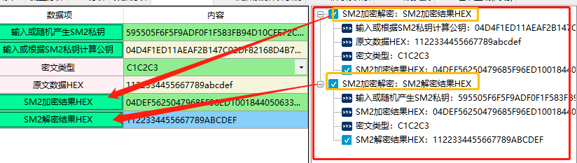

# 国密算法：SM2椭圆曲线公钥算法

SM2是中华人民共和国政府采用的一种公开密钥加密标准，由国家密码管理局于2010年12月17日发布[1][2]，相关标准为“GM/T 0003-2012 《SM2椭圆曲线公钥密码算法》”[1]。2016年，成为中国国家密码标准（GB/T 32918-2016）[3]。

在商用密码体系中，SM2主要用于替换RSA加密算法。SM2与RSA算法相比：加密强度更高、安全性能更强、传输速度更快。

详细介绍请参考：客户端-帮助-（待确认，后续确定后再填写）

## 一、SM2加密解密

1、SM2加密解密算法使用与国家商用密码应用中的消息加解密，消息发送者可以利用接收者的公钥对消息进行加密，接收者用对应的私钥进行解密，获取消息。同时SM2加密解密算法还可为安全产品生产商提供产品和技术的标准定位以及标准化的参考，提高安全产品的可信性与互操作性。

2、输入参数的要求

| 数据项                    | 输入参数要求                                                 |
| :------------------------ | :----------------------------------------------------------- |
| 输入或随机产生SM2私钥     | SM2私钥为HEX格式 SM2私钥是一个大于等于1且小于n-1的整数 （n=FFFFFFFE FFFFFFFF FFFFFFFF FFFFFFFF FFFFFFFF 00000000 FFFFFFFF FFFFFFFC），长度为64个。 |
| 输入或根据SM2私钥计算公钥 | SM2的公钥格式为HEX格式可通过私钥计算得到，也可以手动输入。 SM2公钥是SM2曲线上的一个点，由横坐标和纵坐标两个分量来表示，记为（x，y），简记为Q， 每个分量的长度为64个，总长度为128个。 04开头则总长变为130个，04代表非压缩。 |
| 密文类型                  | 密文类型表示输出结果的不同格式 SM2非对称加密的结果由C1,C2,C3三部分组成。 其中C1是生成随机数的计算出的椭圆曲线点，C2是密文数据，C3是SM3的摘要值。 最开始的国密标准的结果是按C1C2C3顺序的，新标准的是按C1C3C2顺序组成的， 因此本脚本包含了这两个格式格式C1C2C3、C1C3C2，除了这两种标准格式外还支持ASN1格式。 |
| 原文数据HEX               | 输入您需要加密的数据，格式为HEX格式，字符串组成为0-9,A-F，并且长度为偶数 |
| SM2加密结果HEX            | SM2加密结果为Hex格式 如果密文类型选择C1C2C3或C1C3C2则：SM2加密后的密文长度比明文长度增加了194（2长度的04标识 + 128长度的c1 +64长度的c3） 也就是 SM2加密结果长度=原文长度+194 如果选择ASN1格式 结果总是以30开头。 |
| SM2解密结果HEX            | SM2解密是指使用指定的私钥对密文进行解密计算，还原对应明文的过程。 解密结果为HEX格式。 |

3、相关资料

《GMT 0003.1-2012 SM2椭圆曲线公钥密码算法第1部分：总则》

《GMT 0003.4-2012 SM2椭圆曲线公钥密码算法第4部分：公钥加密算法》

《GMT 0003.5-2012 SM2椭圆曲线公钥密码算法第5部分：参数定义》

4、功能演示

| 数据项                    | 测试参数内容                                                 |
| :------------------------ | :----------------------------------------------------------- |
| 输入或随机产生SM2私钥     | 595505F6F5F9ADF0F1F583FB94D10CFE72C3540F34DAE8CBC5E7522041AE98C0 |
| 输入或根据SM2私钥计算公钥 | 04D4F1ED11AEAF2B147C02DF82168D4B76CD42A5D735E72E4FF50145335F9B3283A0B A874F9629ACC387E840C55E6AFA9E10B1A5A8397C25A202BB5ACBD2A195B9 |
| 密文类型                  | C1C2C3                                                       |
| 原文数据HEX               | 1122334455667789abcdef                                       |

根据上述测试数据，结果如下图所示：

当计算出结果后 右侧会记录该过程的输入输出参数，如下图所示：

## 二、SM2密钥交换

1、SM2密钥交换算法适用于商用密码应用中的密钥交换,可满足通信双方经过两次或可选三次信息传递过程,计算获取一个由双方共同决定的共享秘密密钥(会话密钥)。同时,本部分还可为安全产品生产商提供产品和技术的标准定位以及标准化的参考,提高安全产品的可信性与互操作性。SM2密钥协商是在两个用户之间建立一个共享秘密密钥的协商过程，通过这种方式能够确定一个共享秘密密钥的值。

2、输入参数要求

| 数据项                       | 输入参数要求                                                 |
| ---------------------------- | ------------------------------------------------------------ |
| 发起方用户A的ID              | 用户ID为任意长度的UTF-8随机字符串                            |
| 发起方用户A私钥              | 用户A的SM2私钥，格式为HEX格式 SM2私钥是一个大于等于1且小于n-1的整数 （n=FFFFFFFE FFFFFFFF FFFFFFFF FFFFFFFF FFFFFFFF 00000000 FFFFFFFF FFFFFFFC），长度为64个。 |
| 发起方用户A公钥              | 用户A的SM2公钥格式为HEX格式 SM2公钥是SM2曲线上的一个点，由横坐标和纵坐标两个分量来表示，记为（x，y），简记为Q， 每个分量的长度为64个，总长度为128个。04开头则总长变为130个，04代表非压缩 |
| 发起方用户A临时私钥          | 与“发起方用户A私钥”要求相同                                  |
| 发起方用户A临时公钥          | 与“发起方用户A私钥”要求相同                                  |
| 需要输出的密钥数据的比特长度 | 需要输出的密钥比特长度：要求输入的数为正整数。               |
| 响应方用户B的ID              | 与“发起方用户A的ID”                                          |
| 响应方用户B私钥              | 与发起方用户A私钥”要求相同                                   |
| 响应方用户B公钥              | 与“发起方用户A私钥”要求相同                                  |
| 响应方用户B临时私钥          | 与“发起方用户A私钥”要求相同                                  |
| 响应方用户B临时公钥          | 与“发起方用户A私钥”要求相同                                  |
| 发起方用户A计算K1            | 计算共享秘密密钥，结果为HEX格式                              |
| 响应方用户B计算K2            | 计算共享秘密密钥，结果为HEX格式                              |

3、相关资料

《GMT 0003.3-2012 SM2椭圆曲线公钥密码算法第3部分：密钥交换协议》

4、功能演示

| 数据项                       | 测试参数内容                                                 |
| ---------------------------- | ------------------------------------------------------------ |
| 发起方用户A的ID              | aila@ailawuyou.com                                           |
| 发起方用户A私钥              | E8EB67D12DAD9D8FE5EBEBDFA61717F3B30D5E36F21AD13EECE90F08C6CC2C2A |
| 发起方用户A公钥              | 04F4B68C782DD79243FCD4CF319427FCD41E3C948D26276E744A96D2C53AB8EF03B75BDB FBC2C344B80ECCF72824C26C0EF8A3940F9FC34EA66FC0163B25F2D5D0 |
| 响应方用户B的ID              | wuyou@ailawuyou.com                                          |
| 响应方用户B私钥              | 06658B9702E4215172388DB883D794B41E41389A006A55E3CEC90673973C7522 |
| 响应方用户B公钥              | 04B7FD4A9628ACFF8EC59892D0FB19838FBC51EC18C192398C0293E17FCA598FD5DE510B 1A6B69C540992505B8AE19C24FFD319DA421816EB462F03AFDC618B799 |
| 发起方用户A临时私钥          | 735F4B0D2BCD214AB01DE2C635399B74B2552F4A39F4A021E30FAFDA70468B26 |
| 发起方用户A临时公钥          | 042BD66413C18C5712935F29EE4209FBCDA5E28BD9A2BA82EDEE6A9F5D3A006FBD76C8DD3FF 82D2F0196A9EB530830E753716E418C545526203E7A6F80C7A8E371 |
| 响应方用户B临时私钥          | 1385E197446EABD39C62A19BF7A5CBE7F7EF59945C00844BF584874CA6FB2559 |
| 响应方用户B临时公钥          | 048C21F018804D56CE5D93C56C67FDDBED0C717A7099D7CCFAB29D348FE6C2D7CDF43A1AF 0680C8F8302FC131E0A97536B3F53E42A2F58EEA7E113AC2BC6EE2039 |
| 需要输出的密钥数据的比特长度 | 128                                                          |

根据上述测试数据，结果如下图所示，同时右侧会对显示操作记录、调用参数及计算结果。

## 三、SM2签名验签

1、SM2数字签名算法适用于商用密码应用中的数字签名和验证，可满足多种密码应用中的身份认证和数据完整性、真实性的安全需求。同时,本部分还可以为安全产品生产商提供产品和技术的标准定位以及标准化的参考,提高安全产品的可信性与互操作性。

2、输入参数要求

| 数据项                    | 输入参数要求                                                 |
| ------------------------- | ------------------------------------------------------------ |
| 输入或随机产生SM2私钥     | SM2私钥格式为HEX格式 SM2私钥是一个大于等于1且小于n-1的整数（n=FFFFFFFE FFFFFFFF FFFFFFFF FFFFFFFF FFFFFFFF 00000000 FFFFFFFF FFFFFFFC），长度为64个。 |
| 输入或根据SM2私钥计算公钥 | SM2的公钥格式为HEX格式可通过私钥计算得到，也可以手动输入。 SM2公钥是SM2曲线上的一个点，由横坐标和纵坐标两个分量来表示，记为（x，y），简记为Q，每个分量的长度为64个，总长度为128个。04开头则总长变为130个，04代表非压缩 |
| 原文数据                  | 输入您需要加密的数据，格式为HEX格式，字符串组成为0-9,A-F，并且长度为偶数 |
| 用户ID                    |                                                              |

