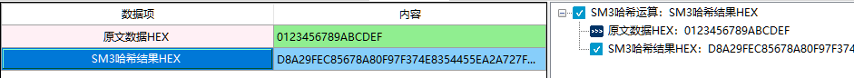

# SM3密码杂凑算法

1、SM3是中华人民共和国政府采用的一种密码散列函数标准，前身为SCH4杂凑算法，由国家密码管理局于2010年12月17日发布，相关标准为“GM/T 0004-2012 《SM3密码杂凑算法》”。2016年，成为中国国家密码标准（GB/T 32905-2016）。
在商用密码体系中，SM3主要用于数字签名及验证、消息认证码生成及验证、随机数生成等，可满足多种密码应用的安全需求 。

此章节讲述的是商用密码应用与检测工具箱中SM3哈希运算。

2、相关资料

《GMT 0004-2012 SM3密码杂凑算法》

3、输入参数要求

| 数据项         | 输入参数要求                                                |
| -------------- | ----------------------------------------------------------- |
| 原文数据HEX    | 输入需要进行哈希计算的原文数据，格式为HEX格式,长度小于262个 |
| SM3哈希结果HEX | SM3生成一个长度为64的杂凑值。格式为HEX格式                  |

4、功能演示

| 数据项      | 测试参数内容     |
| ----------- | ---------------- |
| 原文数据HEX | 0123456789ABCDEF |

根据上述测试数据，点击商用密码应用与检测工具箱中“SM3哈希结果HEX”、会计算出相应结果，同时右侧会显示出该过程的输入输出参数及计算结果，可见下图所示：

