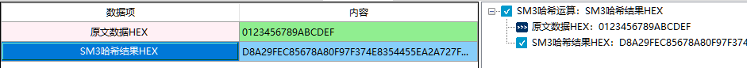

# SM3密码杂凑算法

## SM3哈希运算

1、定义

2、相关资料

3、输入参数要求

| 数据项         | 输入参数要求 |
| -------------- | ------------ |
| 原文数据HEX    |              |
| SM3哈希结果HEX |              |

4、功能演示

| 数据项      | 测试参数内容 |
| ----------- | ------------ |
| 原文数据HEX |              |

根据上述测试数据，点击商用密码应用与检测工具箱中“SM3哈希结果HEX”、会计算出相应结果，同时右侧会显示出该过程的输入输出参数及计算结果，可见下图所示：

