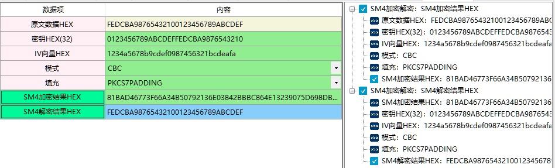
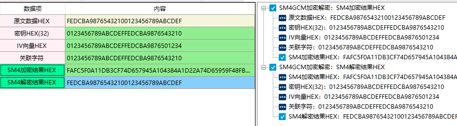

# SM4分组算法

## 一、SM4加密解密

1、定义

2、相关资料

3、输入参数要求

| 数据项         | 输入参数要求 |
| -------------- | ------------ |
| 原文数据HEX    |              |
| 密钥HEX(32)    |              |
| IV向量HEX      |              |
| 模式           |              |
| 填充           |              |
| SM4加密结果HEX |              |
| SM4解密结果HEX |              |

4、功能演示

| 数据项      | 测试参数内容                     |
| ----------- | -------------------------------- |
| 原文数据HEX | FEDCBA98765432100123456789ABCDEF |
| 密钥HEX(32) | 0123456789ABCDEFFEDCBA9876543210 |
| IV向量HEX   | 1234a5678b9cdef0987456321bcdeafa |
| 模式        | CBC                              |
| 填充        | NKCS7PADDING                     |

根据上述测试数据，点击商用密码应用与检测工具箱中“SM4加密结果HEX”、 “SM4解密结果HEX”按钮，会计算出相应结果，同时右侧会显示出该过程的输入输出参数及计算结果，可见下图所示：

## 二、SM4对称算法

1、定义

2、相关资料

3、输入参数要求及功能演示可参考SM4加密解密部分

## 三、SM4CCM加密解密

1、定义

2、相关资料

3、输入参数要求

| 数据项         | 输入参数要求 |
| -------------- | ------------ |
| 原文数据HEX    |              |
| 密钥HEX(32)    |              |
| IV向量HEX      |              |
| 关联字符       |              |
| SM4加密结果HEX |              |
| SM4解密结果HEX |              |

4、功能演示

| 数据项      | 测试参数内容                     |
| ----------- | -------------------------------- |
| 原文数据HEX | FEDCBA98765432100123456789ABCDEF |
| 密钥HEX(32) | 0123456789ABCDEFFEDCBA9876543210 |
| IV向量HEX   | 0123456789ABCDEFFEDCBA9876501234 |
| 关联字符    | 0123456789ABCDEFFEDCBA9876543210 |

根据上述测试数据，点击商用密码应用与检测工具箱中“SM4加密结果HEX”、 “SM4解密结果HEX”按钮，会计算出相应结果，同时右侧会显示出该过程的输入输出参数及计算结果，可见下图所示

## 四、SM4GCM加密解密

1、定义

2、相关资料

3、输入参数要求及功能演示可参考SM4CCM加密解密部分

