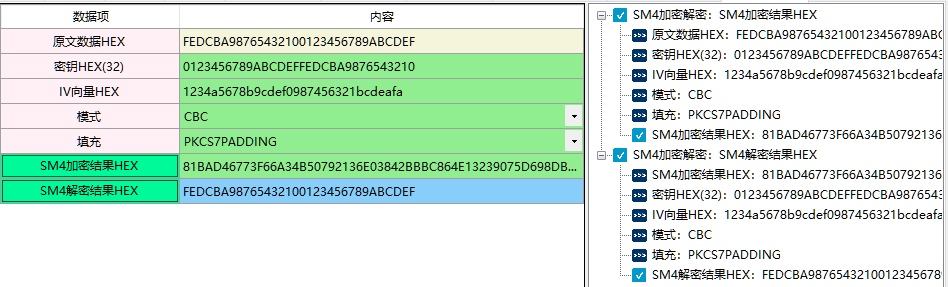
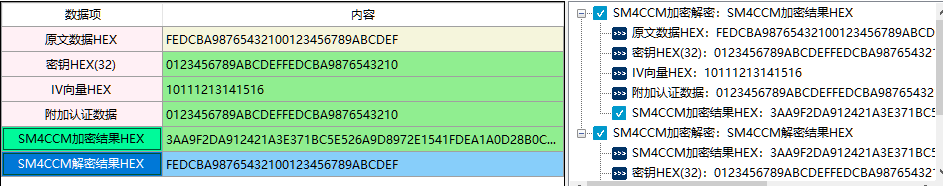
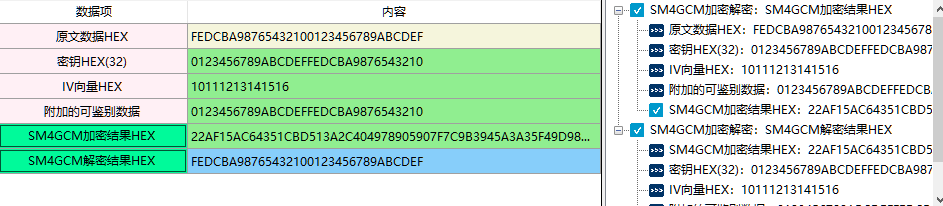

# SM4分组算法

1、SM4密码算法是一个分组算法。该算法的分组长度为32个,密钥长度为32个。加密算法与密钥扩展算法都采用32轮非线性迭代结构。数据解密和数据加密的算法结构相同,只是轮密钥的使用顺序相反,解密轮密钥是加密轮密钥的逆序。   
​		2021年6月25日，我国SM4分组密码算法作为国际标准ISO/IEC 18033-3：2010/AMD1：2021《信息技术 安全技术 加密算法 第3部分：分组密码 补篇1：SM4》，由国际标准化组织ISO/IEC正式发布。
​		SM4分组密码算法是继SM2/SM9数字签名算法、SM3密码杂凑算法、祖冲之密码算法和SM9标识加密算法之后，我国又一个商用密码算法被纳入ISO/IEC国际标准正式发布，标志着我国商用密码算法国际标准体系进一步完善，展现了我国先进的密码科技水平和国际标准化能力，对提升我国商用密码产业发展、推动商用密码更好服务“一带一路”建设具有重要意义。
​		SM4分组算法在商用密码应用与检测工具箱中包含了SM4加密解密、SM4对称算法及SM4CCM加密解密和SM4GCM加密解密四种。其中SM4加密解密与SM4对称算法输入参数要求等相同，本章节将其放在一起做相关介绍。

2、相关资料：

《GMT 0002-2012 SM4分组密码算法》

## 一、SM4加密解密&SM4对称算法

1、输入参数要求

| 数据项         | 输入参数要求                                                 |
| -------------- | ------------------------------------------------------------ |
| 原文数据HEX    | 输入需要加密的原文数据，格式为HEX格式，填充和模式各种组合情况对原文数据长度的要求详见 注释1 |
| 密钥HEX(32)    | 密钥的长度是32个 密钥是一种参数，它是在明文转换为密文或将密文转换为明文的算法中输入的参数。 |
| IV向量HEX      | ECB模式不需要IV IV格式为HEX格式     在密码学的领域里，初始向量（英语：initialization vector，缩写为IV），或译初向量，又称初始变量（starting variable，缩写为SV)，是一个固定长度的输入值。一般的使用上会要求它是随机数或伪随机数（pseudorandom）。使用随机数产生的初始向量才能达到语义安全（消息验证码也可能用到初始向量），并让攻击者难以对原文一致且使用同一把密钥生成的密文进行破解。在区块加密中，使用了初始向量的加密模式被称为区块加密模式。填充和模式各种组合情况对IV长度的要求详见 注释2 |
| 模式           | 常用的5种分组模式：ECB、CBC、CFB、OFB、CTR、其他模式：CTS、EAX、OCB、OPEN PGP CFB: PGP 、SIC，详见 注释3 |
| 填充           | 在分组对称加密算法中，我们通常在加密之前在明文数据的末尾添加对应的填充数据使数据达到算法块大小的倍数；并且在解密数据之后将对应的填充内容去掉。 对原文使用的填充方法详细介绍见 注释4 |
| SM4加密结果HEX | SM4将数据加密后的结果，格式为HEX格式                         |
| SM4解密结果HEX | SM4将数据解密后的原文，格式为HEX格式                         |

** 注释1：**

以下是填充和模式各种组合情况对原文数据长度的要求，以下要求是可以加密出结果的最低要求。
例如
表格中提到32的倍数 表示 原文数据长度为32的倍数

=2表示 长度至少为2个 如：输入“AB”就是两个
X表示不能这样组合使用
表格中只写了数字 32 表示固定长度 只能为32个
同时出现>=x和<=y表示 最小长度为x最大长度y

<table>
       <tr>
           <td rowspan="2">填充</td>
           <td colspan="11" align="center">模式</td>
       </tr>
        <tr>   
              <td>ECB</td>
              <td>CBC</td>
              <td>CFB</td>
              <td>CTR</td>
              <td>CTS</td>
              <td>EAX</td>
              <td>GOFB</td>
              <td>OCB</td>
              <td>OFB</td>
              <td>OPENPGPCFB</td>
              <td>SIC</td>
        </tr>
        <tr>
              <td>NOPADDING</td>
              <td>32的倍数</td>
              <td>32的倍数</td>
              <td>>=2</td>
              <td>>=2</td>
              <td>>=32</td>
              <td>无限制</td>
              <td>X</td>
              <td>无限制</td>
              <td>>=2</td>
              <td>>=2</td>
              <td>>=2</td>
        </tr>
        <tr>
              <td>RAW</td>
              <td>无限制</td>
              <td>32</td>
              <td>>=2</td>
              <td>>=2</td>
              <td>>=32</td>
              <td>X</td>
              <td>X</td>
              <td>X</td>
              <td>>=2</td>
              <td>>=2</td>
              <td>>=2</td>
        </tr>
           <tr>
              <td>ISO10126D2PADDING</td>
              <td>无限制</td>
              <td>无限制</td>
              <td>无限制</td>
              <td>无限制</td>
              <td>>=32</td>
              <td>X</td>
              <td>X</td>
              <td>X</td>
              <td>无限制</td>
              <td>无限制</td>
              <td>无限制</td>
        </tr>
        <tr>
              <td>ISO7816_4PADDING</td>
              <td>无限制</td>
              <td>无限制</td>
              <td>无限制</td>
              <td>无限制</td>
              <td>>=32</td>
              <td>X</td>
              <td>X</td>
              <td>X</td>
              <td>无限制</td>
              <td>无限制</td>
              <td>无限制</td>
        </tr>
            <tr>
              <td>ISO9797_1PADDING</td>
              <td>无限制</td>
              <td>无限制</td>
              <td>无限制</td>
              <td>无限制</td>
              <td>>=32</td>
              <td>X</td>
              <td>X</td>
              <td>X</td>
              <td>无限制</td>
              <td>无限制</td>
              <td>无限制</td>
        </tr>
        <tr>
              <td>OAEPPADDING</td>
              <td>无限制</td>
              <td>无限制</td>
              <td>>=2</td>
              <td>>=2</td>
              <td>>=32</td>
              <td>X</td>
              <td>X</td>
              <td>X</td>
              <td>>=2</td>
              <td>>=2</td>
              <td>>=2</td>
        </tr>
        <tr>
              <td>OAEPWITHMD5ANDMGF1PADDING</td>
              <td>无限制</td>
              <td>无限制</td>
              <td>>=2</td>
              <td>>=2</td>
              <td>>=32</td>
              <td>X</td>
              <td>X</td>
              <td>X</td>
              <td>>=2</td>
              <td>>=2</td>
              <td>>=2</td>
        </tr>
        <tr>
              <td>OAEPWITHSHA_1ANDMGF1PADDING</td>
              <td>无限制</td>
              <td>无限制</td>
              <td>>=2</td>
              <td>>=2</td>
              <td>>=32</td>
              <td>X</td>
              <td>X</td>
              <td>X</td>
              <td>>=2</td>
              <td>>=2</td>
              <td>>=2</td>
        </tr>
        <tr>
              <td>OAEPWITHSHA_224ANDMGF1PADDING</td>
              <td>无限制</td>
              <td>无限制</td>
              <td>>=2</td>
              <td>>=2</td>
              <td>>=32</td>
              <td>X</td>
              <td>X</td>
              <td>X</td>
              <td>>=2</td>
              <td>>=2</td>
              <td>>=2</td>
        </tr>
        <tr>
              <td>OAEPWITHSHA_256ANDMGF1PADDING</td>
              <td>无限制</td>
              <td>无限制</td>
              <td>>=2</td>
              <td>>=2</td>
              <td>>=32</td>
              <td>X</td>
              <td>X</td>
              <td>X</td>
              <td>>=2</td>
              <td>>=2</td>
              <td>>=2</td>
        </tr>
        <tr>
              <td>OAEPWITHSHA_384ANDMGF1PADDING</td>
              <td>无限制</td>
              <td>无限制</td>
              <td>>=2</td>
              <td>>=2</td>
              <td>>=32</td>
              <td>X</td>
              <td>X</td>
              <td>X</td>
              <td>>=2</td>
              <td>>=2</td>
              <td>>=2</td>
        </tr>
        <tr>
              <td>OAEPWITHSHA_512ANDMGF1PADDING</td>
              <td>无限制</td>
              <td>无限制</td>
              <td>>=2</td>
              <td>>=2</td>
              <td>>=32</td>
              <td>X</td>
              <td>X</td>
              <td>X</td>
              <td>>=2</td>
              <td>>=2</td>
              <td>>=2</td>
        </tr>
        <tr>
              <td>PKCS1PADDING</td>
              <td>无限制</td>
              <td>无限制</td>
              <td>>=2</td>
              <td>>=2</td>
              <td>>=32</td>
              <td>X</td>
              <td>X</td>
              <td>X</td>
              <td>>=2</td>
              <td>>=2</td>
              <td>>=2</td>
        </tr>
        <tr>
              <td>PKCS5PADDING</td>
              <td>无限制</td>
              <td>无限制</td>
              <td>无限制</td>
              <td>无限制</td>
              <td>>=32</td>
              <td>X</td>
              <td>X</td>
              <td>X</td>
              <td>无限制</td>
              <td>无限制</td>
              <td>无限制</td>
        </tr>
        <tr>
              <td>PKCS7PADDING</td>
              <td>无限制</td>
              <td>无限制</td>
              <td>无限制</td>
              <td>无限制</td>
              <td>>=32</td>
              <td>X</td>
              <td>X</td>
              <td>X</td>
              <td>无限制</td>
              <td>无限制</td>
              <td>无限制</td>
        </tr>
        <tr>
              <td>TBCPADDING</td>
              <td>无限制</td>
              <td>无限制</td>
              <td>无限制</td>
              <td>无限制</td>
              <td>>=32</td>
              <td>X</td>
              <td>X</td>
              <td>X</td>
              <td>无限制</td>
              <td>无限制</td>
              <td>无限制</td>
        </tr>
        <tr>
              <td>WITHCTS</td>
              <td>>=32</td>
              <td>>=32</td>
              <td>X</td>
              <td>>=32</td>
              <td>>=32</td>
              <td>X</td>
              <td>X</td>
              <td>X</td>
              <td>X</td>
              <td>>=32</td>
              <td>>=32</td>
        </tr>
        <tr>
              <td>X923PADDING</td>
              <td>无限制</td>
              <td>无限制</td>
              <td>无限制</td>
              <td>无限制</td>
              <td>>=32</td>
              <td>X</td>
              <td>X</td>
              <td>X</td>
              <td>无限制</td>
              <td>无限制</td>
              <td>无限制</td>
        </tr>
        <tr>
              <td>ZEROBYTEPADDING</td>
              <td>无限制</td>
              <td>无限制</td>
              <td>无限制</td>
              <td>无限制</td>
              <td>>=32</td>
              <td>X</td>
              <td>X</td>
              <td>X</td>
              <td>无限制</td>
              <td>无限制</td>
              <td>无限制</td>
        </tr>
</table>

** 注释2：**

以下是填充和模式各种组合情况对IV长度的要求，以下要求是可以加密出结果的最低要求。 
例如
表格中提到32的倍数 表示 IV长度为32的倍数

=2表示 长度至少为2个 如：输入“AB”就是两个
X表示不能这样组合使用
表格中只写了数字 32 表示固定长度 只能为32个
同时出现>=x和<=y表示 最小长度为x最大长度y

<table>
       <tr>
           <td rowspan="2">填充</td>
           <td colspan="10" align="center">模式</td>
       </tr>
        <tr>   
              <td>CBC</td>
              <td>CFB</td>
              <td>CTR</td>
              <td>CTS</td>
              <td>EAX</td>
              <td>GOFB</td>
              <td>OCB</td>
              <td>OFB</td>
              <td>OPENPGPCFB</td>
              <td>SIC</td>
        </tr>
        <tr>
              <td>NOPADDING</td>
              <td>32</td>
              <td><=32</td>
              <td>>=16 <=32</td>
              <td>32</td>
              <td><=32</td>
              <td>X</td>
              <td><=30</td>
              <td>无限制</td>
              <td>无限制</td>
              <td>>=16，<=32</td>
        </tr>
        <tr>
              <td>RAW</td>
              <td>32</td>
              <td><=32</td>
              <td>>=16 <=32</td>
              <td>32</td>
              <td>X</td>
              <td>X</td>
              <td>X</td>
              <td>无限制</td>
              <td>无限制</td>
              <td>>=16，<=32</td>
        </tr>
        <tr>
              <td>ISO10126D2PADDING</td>
              <td>32</td>
              <td><=32</td>
              <td>>=16 <=32</td>
              <td>32</td>
              <td>X</td>
              <td>X</td>
              <td>X</td>
              <td>无限制</td>
              <td>无限制</td>
              <td>>=16，<=32</td>
        </tr>
        <tr>
              <td>ISO7816_4PADDING</td>
              <td>32</td>
              <td><=32</td>
              <td>>=16 <=32</td>
              <td>32</td>
              <td>X</td>
              <td>X</td>
              <td>X</td>
              <td>无限制</td>
              <td>无限制</td>
              <td>>=16，<=32</td>
        </tr>
        <tr>
              <td>ISO9797_1PADDING</td>
              <td>32</td>
              <td><=32</td>
              <td>>=16 <=32</td>
              <td>32</td>
              <td>X</td>
              <td>X</td>
              <td>X</td>
              <td>无限制</td>
              <td>无限制</td>
              <td>>=16，<=32</td>
        </tr>
        <tr>
              <td>OAEPPADDING</td>
              <td>32</td>
              <td><=32</td>
              <td>>=16 <=32</td>
              <td>32</td>
              <td>X</td>
              <td>X</td>
              <td>X</td>
              <td>无限制</td>
              <td>无限制</td>
              <td>>=16，<=32</td>
        </tr>
        <tr>
              <td>OAEPWITHMD5ANDMGF1PADDING</td>
              <td>32</td>
              <td><=32</td>
              <td>>=16 <=32</td>
              <td>32</td>
              <td>X</td>
              <td>X</td>
              <td>X</td>
              <td>无限制</td>
              <td>无限制</td>
              <td>>=16，<=32</td>
        </tr>
        <tr>
              <td>OAEPWITHSHA_1ANDMGF1PADDING</td>
              <td>32</td>
              <td><=32</td>
              <td>>=16 <=32</td>
              <td>32</td>
              <td>X</td>
              <td>X</td>
              <td>X</td>
              <td>无限制</td>
              <td>无限制</td>
              <td>>=16，<=32</td>
        </tr>
        <tr>
              <td>OAEPWITHSHA_224ANDMGF1PADDING</td>
              <td>32</td>
              <td><=32</td>
              <td>>=16 <=32</td>
              <td>32</td>
              <td>X</td>
              <td>X</td>
              <td>X</td>
              <td>无限制</td>
              <td>无限制</td>
              <td>>=16，<=32</td>
        </tr>
        <tr>
              <td>OAEPWITHSHA_256ANDMGF1PADDING</td>
              <td>32</td>
              <td><=32</td>
              <td>>=16 <=32</td>
              <td>32</td>
              <td>X</td>
              <td>X</td>
              <td>X</td>
              <td>无限制</td>
              <td>无限制</td>
              <td>>=16，<=32</td>
        </tr>
        <tr>
              <td>OAEPWITHSHA_384ANDMGF1PADDING</td>
              <td>32</td>
              <td><=32</td>
              <td>>=16 <=32</td>
              <td>32</td>
              <td>X</td>
              <td>X</td>
              <td>X</td>
              <td>无限制</td>
              <td>无限制</td>
              <td>>=16，<=32</td>
        </tr>
        <tr>
              <td>OAEPWITHSHA_512ANDMGF1PADDING</td>
              <td>32</td>
              <td><=32</td>
              <td>>=16 <=32</td>
              <td>32</td>
              <td>X</td>
              <td>X</td>
              <td>X</td>
              <td>无限制</td>
              <td>无限制</td>
              <td>>=16，<=32</td>
        </tr>
        <tr>
              <td>PKCS1PADDING</td>
              <td>32</td>
              <td><=32</td>
              <td>>=16 <=32</td>
              <td>32</td>
              <td>X</td>
              <td>X</td>
              <td>X</td>
              <td>无限制</td>
              <td>无限制</td>
              <td>>=16，<=32</td>
        </tr>
        <tr>
              <td>PKCS5PADDING</td>
              <td>32</td>
              <td><=32</td>
              <td>>=16 <=32</td>
              <td>32</td>
              <td>X</td>
              <td>X</td>
              <td>X</td>
              <td>无限制</td>
              <td>无限制</td>
              <td>>=16，<=32</td>
        </tr>
        <tr>
              <td>PKCS7PADDING</td>
              <td>32</td>
              <td><=32</td>
              <td>>=16 <=32</td>
              <td>32</td>
              <td>X</td>
              <td>X</td>
              <td>X</td>
              <td>无限制</td>
              <td>无限制</td>
              <td>>=16，<=32</td>
        </tr>
        <tr>
              <td>TBCPADDING</td>
              <td>32</td>
              <td><=32</td>
              <td>>=16 <=32</td>
              <td>32</td>
              <td>X</td>
              <td>X</td>
              <td>X</td>
              <td>无限制</td>
              <td>无限制</td>
              <td>>=16，<=32</td>
        </tr>
        <tr>
              <td>WITHCTS</td>
              <td>32</td>
              <td>x</td>
              <td>>=16 <=32</td>
              <td>32</td>
              <td>X</td>
              <td>X</td>
              <td>X</td>
              <td>x</td>
              <td>无限制</td>
              <td>>=16，<=32</td>
        </tr>
        <tr>
              <td>X923PADDING</td>
              <td>32</td>
              <td><=32</td>
              <td>>=16 <=32</td>
              <td>32</td>
              <td>X</td>
              <td>X</td>
              <td>X</td>
              <td>无限制</td>
              <td>无限制</td>
              <td>>=16，<=32</td>
        </tr>
        <tr>
              <td>ZEROBYTEPADDING</td>
              <td>32</td>
              <td><=32</td>
              <td>>=16 <=32</td>
              <td>32</td>
              <td>X</td>
              <td>X</td>
              <td>X</td>
              <td>无限制</td>
              <td>无限制</td>
              <td>>=16，<=32</td>
        </tr>
</table>

** 注释3：**

使用分组模式是因为明文的长度不固定，而分组密码只能处理特定长度的一块数据，这就需要对分组密码的算法进行迭代，以便将一段很长的明文全部加密，而迭代的方法就是分组的模式。 
    常用的5种分组模式： 
    注：ECB模式不需要IV 
    ECB（电子密码本模式）：处理定长的数据，如AES处理128bit，那么将明文切分成若干个128bit，分别加密。这种模式就是ECB模式，实际上有很明显的弱点，现在已经不被使用。 
    CBC模式（密码分组链接模式）：CBC模式由IBM发明与1976年，在CBC模式中，每个平文块先与前一个密文块进行异或后，再进行加密。在这种方法中，每个密文块都依赖于它前面的所有密文块。同时，为了保证每条消息的唯一性，在第一个块中需要使用初始化向量。 
    CFB模式 (密文反馈模式）：CFB又称密文反馈模式，前一个密文分组会被送入密码算法的输入端，再将输出的结果与明文做异或。与ECB和CBC模式只能够加密块数据不同，CFB能够将块密文（Block Cipher）转换为流密文。 
    OFB模式（输出反馈模式）：OFB又称输出反馈模式，前一组密码算法输出会输入到下一组密码算法输入。先用块加密器生成密钥流，然后再将密钥流与明文流异或得到密文流，解密是先用块加密器生成密钥流，再将密钥流与密文流异或得到明文，由于异或操作的对称性所以加密和解密的流程是完全一样的。 
    CTR模式全称CounTeR模式（计数器模式）：CTR模式是一种通过将逐次累加的计数器进行加密来生成密钥流的流密码。CTR模式中，每个分组对应一个逐次累加的计数器，并通过对计数器进行加密来生成密钥流。也就是说，最终的密文分组是通过将计数器加密而得到的比特序列，与明文分组进行XOR而得到的。 
    其它模式： 
    CTS模式(Cipher Text Stealing Mode)（密文窃取模式）：是ECB和CBC组合使用的典例，将最后一个数据块之前的密文块代替padding使用 
    EAX 模式(encrypt-then-authenticate-then-translate ) （先加密然后认证，然后翻译）：加密分组密码的一种操作模式。它是一种带有关联数据的身份验证加密 ( AEAD ) 算法，旨在通过两遍方案 同时提供消息的身份验证和隐私（经过身份验证的加密），一个用于实现隐私，一个用于每个块的真实性。 
    OCB模式（偏移码本模式）：是一种用于密码块密码的经过验证的加密 操作模式。OCB 模式旨在提供消息身份验证和隐私。它本质上是一种将消息认证码(MAC) 集成到分组密码操作中的方案。 
   OPEN PGP CFB: PGP 是 1990 年左右由 菲利普·齐墨尔曼（Phil Zimmermann）个人编写的密码软件，现在依然在世界上被广泛使用。 PGP这个名字是 Pretty Good Privacy（很好的隐私）的缩写。PGP 支持用对称密码进行加密和解密。模式使用的是 CFB 模式。 
    SIC模式：CTR模式（Counter mode，CM）也被称为ICM模式（Integer Counter Mode，整数计数模式）和SIC模式（Segmented Integer Counter）。

** 注释4：**

在分组对称加密算法中，我们通常在加密之前在明文数据的末尾添加对应的填充数据使数据达到算法块大小的倍数；并且在解密数据之后将对应的填充内容去掉。
对原文使用的填充方法：
**NOPadding：**不填充 
**PKCS1Padding:** PKCS#1中规定当RSA的密钥长度是1024b,如果使用PKCS1Padding填充，则原文数据最多117B。如果原文不满足长度要求，则在加密前需要进行填充。 
**PKCS1**填充格式如下:Padding = 00 + BT + PS + 00 + D 
00为固定字节 
BT为处理模式 
PS为填充字节，填充数量为k - 3 - D，k表示密钥长度, D表示原文长度。PS的最小长度为8个字节。填充的值根据BT值来定： 
BT = 00时，填充全00 
BT = 01时，填充全FF 
BT = 02时，随机填充，但不能为00。 
**PKCS5Padding/PKCS7Padding：**填充至符合块大小的整数倍，填充值为填充数量数，PKCS5Padding的块大小应为8个字节，而PKCS7Padding的块大小可以在1~255的范围内。 
**ISO 10126Padding：**目前也是已经撤销的标准，是通过随机数作为填充内容并在填充内容的最后一个字节指定填充内容的长度。
**ISO7816-4Padding:**填充至符合块大小的整数倍，填充值第一个字节为0x80，其他字节填0x00。
**ISO9797_1Padding:**  定义了三种填充方法：    填充方法 1  
   如有必要，将值为 0 的位添加到数据的末尾，直到填充的数据是n的倍数。（如果原始数据已经是n的倍数，则不添加任何位。） 
   填充方法 2  
   在数据末尾添加一个值为 1 的位。然后，如有必要，将值为 0 的位添加到数据的末尾，直到填充的数据是n的倍数。 
   填充方法 3  
   填充数据包括（按此顺序）： 
       以大端二进制表示的未填充数据的长度（以位为单位），以n位表示（即一个密码块） 
       未填充的数据 
       使总长度达到n位的倍数所需的值 0 的位数（可能没有） 
没有必要传输或存储填充位，因为接收者可以重新生成它们，知道未填充数据的长度和使用的填充方法。 
**TBCPadding(Trailling-Bit-Compliment):**填充至符合块大小的整数倍，原文最后一位为1时填充0x00，最后一位为0时填充0xFF。 
OAEP(最优非对称加密填充（英语：Optimal Asymmetric Encryption Padding)):一种经常与RSA加密一起使用的填充方案。OAEP 由 Mihir Bellare 和 Phillip Rogaway 发明，随后在 PKCS#1 v2 和 RFC 2437中得到标准化。
**X923Padding:**填充至符合块大小的整数倍，填充值最后一个字节为填充的数量数，其他字节填0
**ZEROPadding：**零填充是指将需要填充的所有字节都填充为零，该方案尚未被标准化。零填充也被叫做空填充或零字节填充。

2、功能演示

| 数据项      | 测试参数内容                     |
| ----------- | -------------------------------- |
| 原文数据HEX | FEDCBA98765432100123456789ABCDEF |
| 密钥HEX(32) | 0123456789ABCDEFFEDCBA9876543210 |
| IV向量HEX   | 1234a5678b9cdef0987456321bcdeafa |
| 模式        | CBC                              |
| 填充        | NKCS7PADDING                     |

根据上述测试数据，点击商用密码应用与检测工具箱中“SM4加密结果HEX”、 “SM4解密结果HEX”按钮，会计算出相应结果，同时右侧会显示出该过程的输入输出参数及计算结果，可见下图所示：

## 二、SM4CCM加密解密

1、SM4算法与MAC结合诞生了CCM等高级模式。
     CCM是Cipher Block Chaining Message Authentication Code (CBC-MAC)和Counter模式（CTR）的组合。可以同时生存认证信息和对数据加密。CCM广泛用于互联网和物联网中对传输数据进行保护，比如WiFi安全中的WPE协议，它就使用了AES-CCM模式。

2、相关资料

资料参考 rfc3610

3、输入参数要求

| 数据项            | 输入参数要求                                                 |
| ----------------- | ------------------------------------------------------------ |
| 原文数据HEX       | 输入需要加密的原文数据，格式为HEX格式，可以为空              |
| 密钥HEX(32)       | 密钥的长度是32个 密钥是一种参数，它是在明文转换为密文或将密文转换为明文的算法中输入的参数。 |
| IV向量HEX         | IV格式为HEX格式，长度最少14个最大不超过26个。 IV本质上是一个noce，即在指定上下文中唯一的一个值。<br/ >在密码学的领域里，初始向量（英语：initialization vector，缩写为IV），或译初向量，又称初始变量（starting variable，缩写为SV)，是一个固定长度的输入值。一般的使用上会要求它是随机数或伪随机数（pseudorandom）。使用随机数产生的初始向量才能达到语义安全（消息验证码也可能用到初始向量），并让攻击者难以对原文一致且使用同一把密钥生成的密文进行破解。在区块加密中，使用了初始向量的加密模式被称为区块加密模式。 |
| 附加认证数据      | 附加认证数据格式为HEX格式，可以为空，最大长度小于264个，这些附加数据经过身份验证但未加密，并且不包括在此模式的输出中。它可用于验证明文数据包报头或影响消息解释的上下文信息。 |
| SM4CCM加密结果HEX | SM4CCM将数据加密后的结果，格式为HEX格式                      |
| SM4CCM解密结果HEX | SM4CCM将数据解密后的原文，格式为HEX格式                      |

4、功能演示

| 数据项       | 测试参数内容                     |
| ------------ | -------------------------------- |
| 原文数据HEX  | FEDCBA98765432100123456789ABCDEF |
| 密钥HEX(32)  | 0123456789ABCDEFFEDCBA9876543210 |
| IV向量HEX    | 10111213141516                   |
| 附加认证数据 | 0123456789ABCDEFFEDCBA9876543210 |

根据上述测试数据，点击商用密码应用与检测工具箱中“SM4CCM加密结果HEX”、 “SM4CCM解密结果HEX”按钮，会计算出相应结果，同时右侧会显示出该过程的输入输出参数及计算结果，可见下图所示

## 三、SM4GCM加密解密

1、伽罗瓦/计数器模式(GCM)是一种对数据的加密鉴别模式,GCM使用了加密的计数器运算模式来确保数据的机密性,并且通过使用有限域上的通用的杂凑函数来保证机密数据的完整性。GCM对于无需加密的附加数据提供了认证,确保其没有被修改。
如果GCM的输人被限制为没有加密的数据,那么GCM的输出结果可被称为GMAC,GMAC是对输入的数据提供可鉴别模式。
GCM有两个相关函数分别被称为鉴别加密和鉴别解密,每一个函数都相对高效的,并且能够并行化的处理。

2、输入参数要求

| 数据项            | 输入参数要求                                                 |
| ----------------- | ------------------------------------------------------------ |
| 原文数据HEX       | 输入需要加密的原文数据，格式为HEX格式，最大长度不超过237-64个。 明文和附加的可鉴别数据是GCM保护的两类数据。GCM保护明文和附加的可鉴别数据的真实性;GCM 也保护明文的机密性,而附加的可鉴别数据则被保留是明文的。 |
| 密钥HEX(32)       | 密钥的长度是32个 密钥是一种参数，它是在明文转换为密文或将密文转换为明文的算法中输入的参数。 |
| IV向量HEX         | IV格式为HEX格式，长度最少14个最大不超过26个。 IV本质上是一个noce，即在指定上下文中唯一的一个值。<br/ >在密码学的领域里，初始向量（英语：initialization vector，缩写为IV），或译初向量，又称初始变量（starting variable，缩写为SV)，是一个固定长度的输入值。一般的使用上会要求它是随机数或伪随机数（pseudorandom）。使用随机数产生的初始向量才能达到语义安全（消息验证码也可能用到初始向量），并让攻击者难以对原文一致且使用同一把密钥生成的密文进行破解。在区块加密中，使用了初始向量的加密模式被称为区块加密模式。 |
| 附加的可鉴别数据  | 附加的可鉴别数据格式为HEX格式，可以为空，最大长度不超过262-1个，明文和附加的可鉴别数据是GCM保护的两类数据。GCM保护明文和附加的可鉴别数据的真实性;GCM 也保护明文的机密性,而附加的可鉴别数据则被保留是明文的。 例如 :在网络协议中,附加的可鉴别数据可以包括地址、端口、序列号,协议版本号,以及说明如何处理明文的其他字段。 |
| SM4CCM加密结果HEX | SM4GCM将数据加密后的结果，格式为HEX格式                      |
| SM4CCM解密结果HEX | SM4GCM将数据解密后的原文，格式为HEX格式                      |

3、功能演示

| 数据项       | 测试参数内容                     |
| ------------ | :------------------------------- |
| 原文数据HEX  | FEDCBA98765432100123456789ABCDEF |
| 密钥HEX(32)  | 0123456789ABCDEFFEDCBA9876543210 |
| IV向量HEX    | 10111213141516                   |
| 附加认证数据 | 0123456789ABCDEFFEDCBA9876543210 |

根据上述测试数据，点击商用密码应用与检测工具箱中“SM4CCM加密结果HEX”、 “SM4CCM解密结果HEX”按钮，会计算出相应结果，同时右侧会显示出该过程的输入输出参数及计算结果，可见下图所示：

