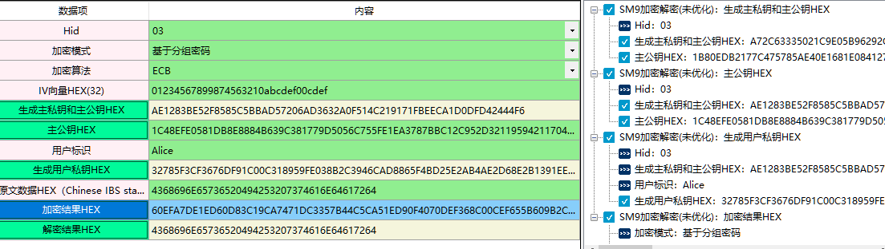
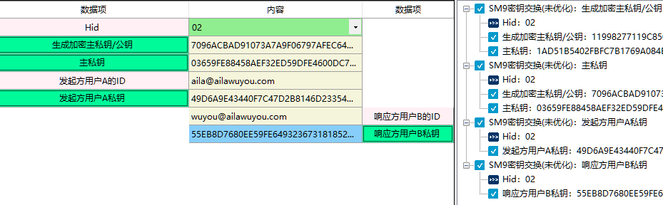
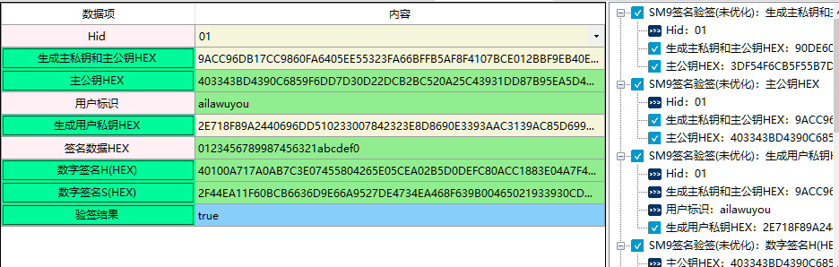

# SM9标识密码算法

## 一、SM9加密解密(未优化)

1、定义

2、相关资料

3、输入参数要求

| 数据项                              | 输入参数要求 |
| ----------------------------------- | ------------ |
| Hid                                 |              |
| 加密模式                            |              |
| 加密算法                            |              |
| IV向量HEX(32)                       |              |
| 生成主私钥和主公钥HEX               |              |
| 主公钥HEX                           |              |
| 用户标识                            |              |
| 生成用户私钥HEX                     |              |
| 原文数据HEX（Chinese IBS standard） |              |
| 加密结果HEX                         |              |
| 解密结果HEX                         |              |

4、功能演示

| 数据项                              | 测试参数内容                             |
| ----------------------------------- | ---------------------------------------- |
| Hid                                 | 03                                       |
| 加密模式                            | 基于分组密码                             |
| 加密算法                            | ECB                                      |
| IV向量HEX(32)                       | 01234567899874563210abcdef00cdef         |
| 用户标识                            | Alice                                    |
| 原文数据HEX（Chinese IBS standard） | 4368696E65736520494253207374616E64617264 |

根据上述测试数据，点击商用密码应用与检测工具箱中“”生成主私钥和主公钥HEX“、“主公钥HEX”及“生成用户私钥HEX”会自动生成相应的内容，生成内容后点击“加密结果HEX”、 “解密结果HEX”按钮，会计算出相应结果，同时右侧会显示出该过程的输入输出参数及计算结果，可见下图所示：

## 二、SM9密钥交换(未优化)

1、定义

2、相关资料

3、输入参数要求

| 数据项              | 输入参数要求 |
| ------------------- | ------------ |
| Hid                 |              |
| 生成加密主私钥/公钥 |              |
| 主私钥              |              |
| 发起方用户A的ID     |              |
| 发起方用户A私钥     |              |
| 响应方用户B的ID     |              |
| 响应方用户B私钥     |              |

4、功能演示

| 数据项              | 测试参数内容                                                 |
| ------------------- | ------------------------------------------------------------ |
| Hid                 | 02                                                           |
| 生成加密主私钥/公钥 | 9B310523400D02BA7A1B1A7896B955C3614C54E727E461C5A70F4A33E80A5BA9 |
| 主私钥              | 4F4FE6095A38D4FE3B432CF3B93394A51C6F445476A63CDC3DB0D85EFBEBC1F362EF4B7D6343E2 BC0F95B38A6EB33887FB262EA13C65A47C6B52CF634E401EBF |
| 发起方用户A的ID     | aila@ailawuyou.com                                           |
| 响应方用户B的ID     | wuyou@ailawuyou.com                                          |

注：当测试参数内容在上述表格中显示是两行或者两行以上，可能会含有换行符，建议复制到txt文档或word文档中取消换行 ，否则会出现报错。

根据上述测试数据，点击商用密码应用与检测工具箱中“”生成加密主私钥/公钥“、“主私钥”会自动生成相应的内容，当数据填写完成后点击“发起方用户A私钥”、 “响应方用户B私钥”按钮，会计算出相应结果，同时右侧会显示出该过程的输入输出参数及计算结果，可见下图所示：

## 三、SM9签名验签(未优化)

1、定义

2、相关资料

3、输入参数要求

| 数据项                | 输入参数要求 |
| --------------------- | ------------ |
| Hid                   |              |
| 生成主私钥和主公钥HEX |              |
| 主公钥HEX             |              |
| 用户标识              |              |
| 生成用户私钥HEX       |              |
| 签名数据H(HEX)        |              |
| 数字签名S(HEX)        |              |
| 验签结果              |              |

4、功能演示

| 数据项      | 输入参数要求               |
| ----------- | -------------------------- |
| Hid         | 01                         |
| 用户标识    | ailawuyou                  |
| 签名数据HEX | 0123456789987456321abcdef0 |

根据上述测试数据，点击商用密码应用与检测工具箱中“生成主私钥和主公钥HEX”、“主公钥HEX”及“生成用户私钥HEX”自动生成内容，当数据填写完成后点击“数字签名H(HEX)”、“数字签名S(HEX)”会计算出相应结果，“验签结果”会对结果进行验签。同时右侧会显示出该过程的输入输出参数及计算结果，可见下图所示：

