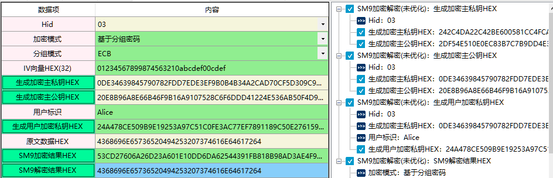
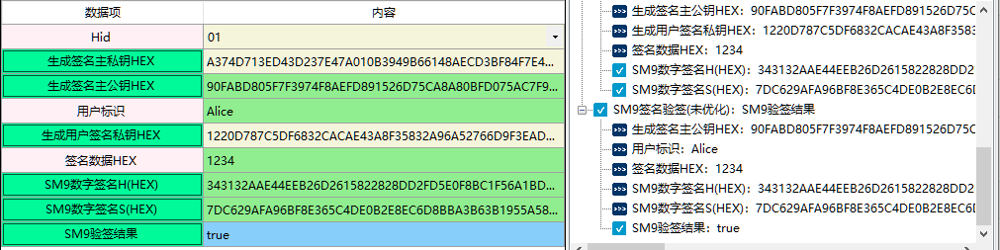

# SM9标识密码算法

SM9是中华人民共和国政府采用的一种标识密码标准，由国家密码管理局于2016年3月28日发布，相关标准为“GM/T 0044-2016 SM9标识密码算法”。
在商用密码体系中，SM9主要用于用户的身份认证。
SM9主要包括三部分：签名算法、密钥交换算法、加密算法，其中SM9签名算法收录于ISO/IEC 14888-3:2018《信息安全技术带附录的数字签名第3部分：基于离散对数的机制》。

## 一、SM9加密解密

1、SM9加密解密,使消息发送者可以利用接收者的标识对消息进行加密，唯有接收者可以用相应的私钥对该密文进行解密，从而获取消息。

2、相关资料

《GMT 0004-2012 SM3密码杂凑算法》 
《GMT 0002-2012 SM4分组密码算法》 
《GMT 0044.1-2016 SM9标识密码算法 第一部分：总则》 
《GMT 0044.4-2016 SM9标识密码算法 第四部分：密钥封装机制和公钥加密算法》

3、输入参数要求

| 数据项                | 输入参数要求                                                 |
| --------------------- | ------------------------------------------------------------ |
| Hid                   | 用来表示加密私钥生成函数的识别符                             |
| 加密模式              | 序列密码：也称为流密码（Stream Cipher），它是对称密码算法的一种。序列密码具有实现简单、便于硬件实施、加解密处理速度快、没有或只有有限的错误传播等特点，因此在实际应用中，特别是专用或机密机构中保持着优势，典型的应用领域包括无线通信、外交通信。 分组密码（block cipher)：数学模型是将明文消息编码表示后的数字（简称明文数字）序列，划分成长度为n的组（可看成长度为n的矢量），每组分别在密钥的控制下变换成等长的输出数字（简称密文数字）序列。 |
| 分组模式              | ECB（电子密码本模式）：处理定长的数据，如AES处理128bit，那么将明文切分成若干个128bit，分别加密。这种模式就是ECB模式，实际上有很明显的弱点，现在已经不被使用。 CBC模式（密码分组链接模式）：CBC模式由IBM发明与1976年，在CBC模式中，每个平文块先与前一个密文块进行异或后，再进行加密。在这种方法中，每个密文块都依赖于它前面的所有密文块。同时，为了保证每条消息的唯一性，在第一个块中需要使用初始化向量。 |
| IV向量HEX(32)         | IV向量，格式为HEX格式，长度为32个。                          |
| 生成主私钥和主公钥HEX | 生成加密主私钥，HEX格式，长度为64个。 加密主密钥，处于标识密码密钥分层结构的最顶层的密钥，包括加密主私钥和加密主公钥，其中加密主公钥公开，加密主私钥由KGC秘密保存。<br/ >KGC:密钥生成中心，负责选择系统参数，生成加密主密钥并产生用户加密私钥。 |
| 主公钥HEX             | 生成加密主公钥，HEX格式，长度为128个。 加密主密钥，处于标识密码密钥分层结构的最顶层的密钥，包括加密主私钥和加密主公钥，其中加密主公钥公开，加密主私钥由     KGC秘密保存。 KGC:密钥生成中心，负责选择系统参数，生成加密主密钥并产生用户加密私钥。 |
| 用户标识              | 用户标识，可唯一确定一个实体身份的信息。标识应由实体无法否认的信息组成，例如实体的可识别名称、电子邮箱、身份证号、电话号码等。 |
| 生成用户私钥HEX       | 生成的用户加密私钥，HEX格式，长度为256个。  用户的加密私钥由密钥生成中心（KGC）使用加密主私钥和用户的标识生成。 |
| 原文数据HEX           | 要加密的原文数据，格式为HEX格式，长度不限                    |
| SM9加密结果HEX        | SM9加密结果，格式为HEX格式                                   |
| SM9解密结果HEX        | SM9解密结果，格式为HEX格式                                   |

4、功能演示

| 数据项        | 测试参数内容                             |
| ------------- | ---------------------------------------- |
| Hid           | 03                                       |
| 加密模式      | 基于分组密码                             |
| 分组模式      | ECB                                      |
| IV向量HEX(32) | 01234567899874563210abcdef00cdef         |
| 用户标识      | Alice                                    |
| 原文数据HEX   | 4368696E65736520494253207374616E64617264 |

根据上述测试数据，点击商用密码应用与检测工具箱中“”生成主私钥和主公钥HEX“、“主公钥HEX”及“生成用户私钥HEX”会自动生成相应的内容，生成内容后点击“SM9加密结果HEX”、 “SM9解密结果HEX”按钮，会计算出相应结果，同时右侧会显示出该过程的输入输出参数及计算结果，可见下图所示：

## 二、SM9密钥交换

1、定义

2、相关资料

3、输入参数要求

| 数据项              | 输入参数要求 |
| ------------------- | ------------ |
| Hid                 |              |
| 生成加密主私钥/公钥 |              |
| 主私钥              |              |
| 发起方用户A的ID     |              |
| 发起方用户A私钥     |              |
| 响应方用户B的ID     |              |
| 响应方用户B私钥     |              |

4、功能演示

| 数据项              | 测试参数内容                                                 |
| ------------------- | ------------------------------------------------------------ |
| Hid                 | 02                                                           |
| 生成加密主私钥/公钥 | 9B310523400D02BA7A1B1A7896B955C3614C54E727E461C5A70F4A33E80A5BA9 |
| 主私钥              | 4F4FE6095A38D4FE3B432CF3B93394A51C6F445476A63CDC3DB0D85EFBEBC1F362EF4B7D6343E2 BC0F95B38A6EB33887FB262EA13C65A47C6B52CF634E401EBF |
| 发起方用户A的ID     | aila@ailawuyou.com                                           |
| 响应方用户B的ID     | wuyou@ailawuyou.com                                          |

注：当测试参数内容在上述表格中显示是两行或者两行以上，可能会含有换行符，建议复制到txt文档或word文档中取消换行 ，否则会出现报错。

根据上述测试数据，点击商用密码应用与检测工具箱中“”生成加密主私钥/公钥“、“主私钥”会自动生成相应的内容，当数据填写完成后点击“发起方用户A私钥”、 “响应方用户B私钥”按钮，会计算出相应结果，同时右侧会显示出该过程的输入输出参数及计算结果，可见下图所示：

## 三、SM9签名验签

1、SM9数字签名算法适用于接收者通过签名者的标识验证数据的完整性和数据发送者的身份，也适用于第三方确定签名及所签数据的真实性。

2、相关资料

《GMT 0044.2-2016 SM9标识密码算法 第二部分：数字签名算法》

3、输入参数要求

| 数据项              | 输入参数要求                                                 |
| ------------------- | ------------------------------------------------------------ |
| Hid                 | 用来表示签名私钥生成函数的识别符                             |
| 生成签名主私钥HEX   | 生成签名主私钥，格式为HEX格式，长度为64个。 签名主密钥处于标识密码密钥分层结构最顶层的密钥，包括签名主私钥和签名主公钥，其中签名主公钥公开，签名主私钥由KGC秘密保存。 在标识密码中，签名主私钥一般由KGC通过随机数发生器产生，签名主公钥由签名主私钥结合系统参数茶树能拿。 KGC:密钥生成中心，负责选择系统参数、生成签名主密钥并产生用户签名私钥 |
| 生成签名主公钥HEX   | 生成签名主公钥，格式为HEX格式，长度为256个。 签名主密钥处于标识密码密钥分层结构最顶层的密钥，包括签名主私钥和签名主公钥，其中签名主公钥公开，签名主私钥由KGC秘密保存。 在标识密码中，签名主私钥一般由KGC通过随机数发生器产生，签名主公钥由签名主私钥结合系统参数茶树能拿。 KGC:密钥生成中心，负责选择系统参数、生成签名主密钥并产生用户签名私钥。 |
| 用户标识            | 用户标识，可唯一确定一个实体身份的信息。标识应由实体无法否认的信息组成，例如实体的可识别名称、电子邮箱、身份证号、电话号码等。 |
| 生成用户签名私钥HEX | 生成用户签名私钥，格式为HEX格式，长度128个。 用户签名私钥由KGC用签名主私钥和用户的标识生成。 |
| 签名数据HEX         | 需要进行签名的明文数据，格式为HEX格式，长度不限。            |
| SM9数字签名H(HEX)   | SM9的签名值包含H和S两部分。 这个是签名值H，格式为HEX格式，长度64个。 |
| SM9数字签名S(HEX)   | SM9的签名值包含H和S两部分。 这个是签名值S，格式为HEX格式，长度为128个 |
| SM9验签结果         | SM9的验签结果，显示是否通过验签。true表示通过验签，false表示未通过验签。 |

4、功能演示

| 数据项      | 输入参数要求               |
| ----------- | -------------------------- |
| Hid         | 01                         |
| 用户标识    | ailawuyou                  |
| 签名数据HEX | 0123456789987456321abcdef0 |

根据上述测试数据，点击商用密码应用与检测工具箱中“生成签名主私钥HEX”、“生成签名主公钥HEX”及“生成用户签名私钥HEX”自动生成内容，当数据填写完成后点击“SM9数字签名H(HEX)”、“SM9数字签名S(HEX)”会计算出相应结果，“验签结果”会对结果进行验签。同时右侧会显示出该过程的输入输出参数及计算结果，可见下图所示：

*注：因此算法暂未优化，所以点击操作按钮后加载数据较慢，建议大家等数据加载出来后点击下一选项。*

