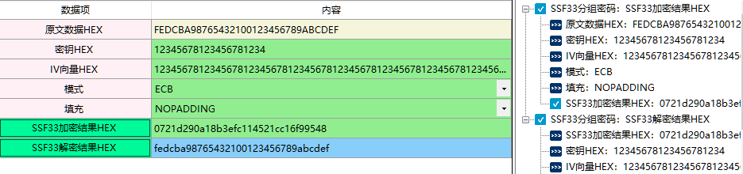

# 国密算法：SSF33加密算法

  该算法使用需要连接硬件key。

## 一、SSF33分组密码

1、定义

2、相关资料

3、输入参数要求

| 数据项           | 输入参数要求 |
| ---------------- | ------------ |
| 原文数据HEX      |              |
| 密钥HEX          |              |
| IV向量HEX        |              |
| 模式             |              |
| 填充             |              |
| SSF33加密结果HEX |              |
| SSF33解密结果HEX |              |

4、功能演示、

| 数据项      | 测试参数内容                                                 |
| ----------- | ------------------------------------------------------------ |
| 原文数据HEX | FEDCBA98765432100123456789ABCDEF                             |
| 密钥HEX     | 12345678123456781234                                         |
| IV向量HEX   | 1234567812345678123456781234567812345678123456781234567812345678 |
| 模式        | ECB                                                          |
| 填充        | NOPADDING                                                    |

根据上述测试数据，点击商用密码应用与检测工具箱中“SSF33加密结果HEX”、 “SSF33解密结果HEX”按钮，会计算出相应结果，同时右侧会显示出该过程的输入输出参数及计算结果，可见下图所示：

## 二、SSF33加密解密

1、定义

2、相关资料

3、输入参数要求及功能演示可参考SSF33分组密码部分

## 三、SSF33对称算法

1、定义

2、相关资料

3、输入参数要求及功能演示可参考SSF33分组密码部分

