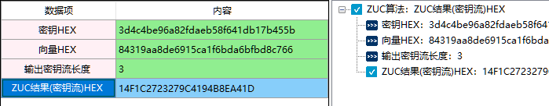
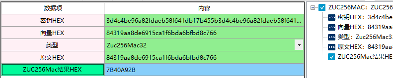
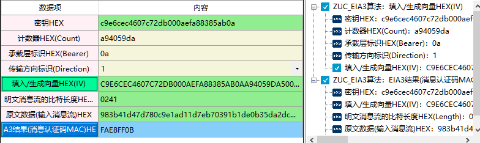
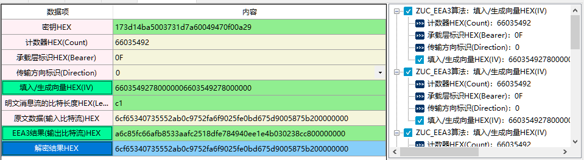

# 祖冲之ZUC流密码算法

## 一、ZUC算法

1、定义

2、相关资料

3、输入参数要求

| 数据项             | 输入参数要求 |
| ------------------ | ------------ |
| 密钥HEX            |              |
| 向量HEX            |              |
| 输出密钥流长度     |              |
| ZUC结果(密钥流)HEX |              |

4、功能演示

| 数据项         | 输入参数要求                     |
| -------------- | -------------------------------- |
| 密钥HEX        | 3d4c4be96a82fdaeb58f641db17b455b |
| 向量HEX        | 84319aa8de6915ca1f6bda6bfbd8c766 |
| 输出密钥流长度 |                                  |

根据上述测试数据，点击商用密码应用与检测工具箱中“ZUC结果（密钥流）HEX”,会计算出相应结果，同时右侧会显示出该过程的输入输出参数及计算结果，可见下图所示：

## 二、ZUC256MAC

1、定义

2、相关资料

3、输入参数要求

| 数据项           | 输入参数要求 |
| ---------------- | ------------ |
| 密钥HEX          |              |
| 向量HEX          |              |
| 类型             |              |
| 原文HEX          |              |
| ZUC256Mac结果HEX |              |

4、功能演示

| 数据项  | 测试参数内容                                                 |
| ------- | ------------------------------------------------------------ |
| 密钥HEX | 3d4c4be96a82fdaeb58f641db17b455b3d4c4be96a82fdaeb58f641db17b455b |
| 向量HEX | 84319aa8de6915ca1f6bda6bfbd8c766                             |
| 类型    | Zuc256Mac32                                                  |
| 原文HEX | 84319aa8de6915ca1f6bda6bfbd8c766                             |

根据上述测试数据，点击商用密码应用与检测工具箱中“ZUC结果（密钥流）HEX”,会计算出相应结果，同时右侧会显示出该过程的输入输出参数及计算结果，可见下图所示：

## 三、ZUC_EIA3算法&ZUC算法的完整性算法

1、定义

2、相关资料

3、输入参数要求

| 数据项                          | 输入参数要求 |
| ------------------------------- | ------------ |
| 密钥HEX                         |              |
| 计数器HEX(Count)                |              |
| 承载层标识HEX(Bearer)           |              |
| 传输方向标识(Direction)         |              |
| 填入/生成向量HEX(IV)            |              |
| 明文消息流的比特长度HEX(Length) |              |
| 原文数据(输入消息流)HEX         |              |
| EIA3结果(消息认证码MAC)HEX      |              |

4、功能演示

| 数据项                          | 测试参数内容                                                 |
| ------------------------------- | ------------------------------------------------------------ |
| 密钥HEX                         | c9e6cec4607c72db000aefa88385ab0a                             |
| 计数器HEX(Count)                | a94059da                                                     |
| 承载层标识HEX(Bearer)           | 0a                                                           |
| 传输方向标识(Direction)         | 1                                                            |
| 明文消息流的比特长度HEX(Length) | 0241                                                         |
| 原文数据(输入消息流)HEX         | 983b41d47d780c9e1ad11d7eb70391b1de0b35da2dc62f83e7b78d6306ca0ea07e941b7be91348f9fcb170 e2217fecd97f9f68adb16e5d7d21e569d280ed775cebde3f4093c5388100000000 |

注：当测试参数内容在上述表格中显示是两行或者两行以上，可能会含有换行符，建议复制到txt文档或word文档中取消换行 ，否则会出现报错。

根据上述测试数据，点击商用密码应用与检测工具箱中“EIA3结果(消息认证码MAC)HEX)”,会计算出相应结果，同时右侧会显示出该过程的输入输出参数及计算结果，可见下图所示：

5、ZUC算法的完整性算法参考上述ZUC_EIA3算法界面。

## 四、ZUC_EEA3算法&ZUC算法的机密性算法

1、定义

2、相关资料

3、输入参数要求

| 数据项                          | 测试参数内容 |
| ------------------------------- | ------------ |
| 密钥HEX                         |              |
| 计数器HEX(Count)                |              |
| 承载层标识HEX(Bearer)           |              |
| 传输方向标识(Direction)         |              |
| 填入/生成向量HEX(IV)            |              |
| 明文消息流的比特长度HEX(Length) |              |
| 原文数据(输入消息流)HEX         |              |
| EIA3结果(消息认证码MAC)HEX      |              |
| 解密结果HEX                     |              |

4、功能演示

| 数据项                          | 输入参数要求                                             |
| ------------------------------- | -------------------------------------------------------- |
| 密钥HEX                         | 173d14ba5003731d7a60049470f00a29                         |
| 计数器HEX(Count)                | 66035492                                                 |
| 承载层标识HEX(Bearer)           | 0F                                                       |
| 传输方向标识(Direction)         | 0                                                        |
| 填入/生成向量HEX(IV)            | 66035492780000006603549278000000                         |
| 明文消息流的比特长度HEX(Length) | c1                                                       |
| 原文数据(输入消息流)HEX         | 6cf65340735552ab0c9752fa6f9025fe0bd675d9005875b200000000 |

根据上述测试数据，点击商用密码应用与检测工具箱中“EEA3结果(输出比特流)HEX)”、”解密结果HEX“会计算出相应结果，同时右侧会显示出该过程的输入输出参数及计算结果，可见下图所示：

5、ZUC算法的机密性算法参考上述ZUC_EEA3算法算法界面。
