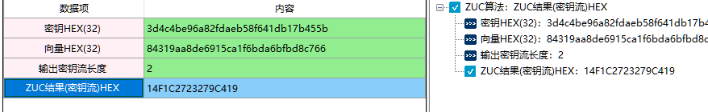
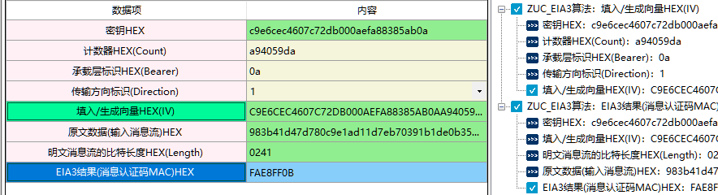
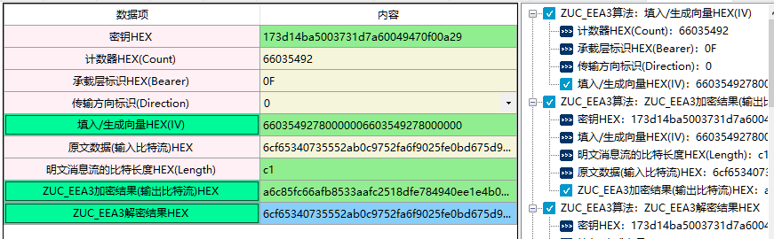
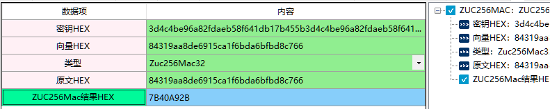

# 祖冲之ZUC流密码算法

1、 祖冲之算法集（ZUC算法）是由我国学者自主设计的加密和完整性算法，包括祖冲之算法、加密算法128-EEA3和完整性算法128-EIA3，已经被国际组织3GPP推荐为4G无线通信的第三套国际加密和完整性标准的候选算法。由中国科学院信息工程研究所信息安全国家重点实验室和中国科学院数据与通信保护研究教育中心（DCS中心）联合主办的《第一届祖冲之算法国际研讨会》于2010年12月2至3在北京召开。本次国际研讨会对于加强祖冲之算法研究分析成果的国内和国际交流，扩大祖冲之算法的公开评估范围，加强祖冲之算法的安全性评估力度，进而推进祖冲之算法4G通信国际加密标准的进度具有重要的现实意义。

2、相关资料

《GMT 0001.1-2012 祖冲之序列密码算法第1部分：算法描述》

《GMT 0001.2-2012 祖冲之序列密码算法第2部分：基于祖冲之算法的机密性算法》

《GMT 0001.3-2012 祖冲之序列密码算法第3部分：基于祖冲之算法的完整性算法》

## 一、ZUC算法

1、输入参数要求

| 数据项             | 输入参数要求                                                 |
| ------------------ | ------------------------------------------------------------ |
| 密钥HEX(32)        | ZUC是一个面向字的流密码。 密钥长度为32个，格式为HEX格式。 |
| 向量HEX(32)        | ZUC是一个面向字的流密码。 向量IV长度为32个，格式为HEX。  |
| 输出密钥流长度     | 输出密钥流的个数，每个密钥流长度为8个。例如如果这里输入2，那么ZUC的结果就是XXXXXXXX  XXXXXXXX长度为16个。 |
| ZUC结果(密钥流)HEX | zuc计算输出的密钥流，长度8个为一组。                         |

2、功能演示

| 数据项         | 输入参数要求                     |
| -------------- | -------------------------------- |
| 密钥HEX        | 3d4c4be96a82fdaeb58f641db17b455b |
| 向量HEX        | 84319aa8de6915ca1f6bda6bfbd8c766 |
| 输出密钥流长度 | 2                                |

根据上述测试数据，点击商用密码应用与检测工具箱中“ZUC结果（密钥流）HEX”,会计算出相应结果，同时右侧会显示出该过程的输入输出参数及计算结果，可见下图所示：

## 二、ZUC_EIA3算法&ZUC算法的完整性算法

1、输入参数要求

| 数据项                          | 输入参数要求                                                 |
| ------------------------------- | ------------------------------------------------------------ |
| 密钥HEX                         | ZUC是一个面向字的流密码。 密钥长度为32个，格式为HEX格式。 |
| 计数器HEX(Count)                | 计数器长度不超过8个，格式为HEX。                             |
| 承载层标识HEX(Bearer)           | 承载层标识，长度为2个，格式为HEX。输入值要小于1f (31)  。 输入范围:第一位 0或1 第二位0-f |
| 传输方向标识(Direction)         | 传输方向标识                                                 |
| 填入/生成向量HEX(IV)            | IV向量，格式为HEX格式，长度为64个。 可以自己手动设置IV，也可以通过设置参数计算IV。 |
| 原文数据(输入消息流)HEX         | 原文数据（输入消息流）：格式为HEX格式，长度不限。            |
| 明文消息流的比特长度HEX(Length) | 输入消息流的比特长度，格式为HEX格式，长度不超过4个。 输入长度要求：输入的参数转为10进制后（可用实用工具中的进制转换器转换），不超过原文数据长度/2*8。 例如，我原文输入长度为4个。4/2×8=16。那么明文消息流的比特长度输入的值就要小于等于16，而16的hex格式为10所以，输入的值不能比10大，如果输入11就会出现错误。 |
| EIA3结果(消息认证码MAC)HEX      | ZUC_EIAC计算的MAC结果，格式为HEX,长度为8个。                 |

2、功能演示

| 数据项                          | 测试参数内容                                                 |
| ------------------------------- | ------------------------------------------------------------ |
| 密钥HEX                         | c9e6cec4607c72db000aefa88385ab0a                             |
| 计数器HEX(Count)                | a94059da                                                     |
| 承载层标识HEX(Bearer)           | 0a                                                           |
| 传输方向标识(Direction)         | 1                                                            |
| 明文消息流的比特长度HEX(Length) | 0241                                                         |
| 原文数据(输入消息流)HEX         | 983b41d47d780c9e1ad11d7eb70391b1de0b35da2dc62f83e7b78d6306ca0ea07e941b7be91348f9fcb170 e2217fecd97f9f68adb16e5d7d21e569d280ed775cebde3f4093c5388100000000 |

注：当测试参数内容在上述表格中显示是两行或者两行以上，可能会含有换行符，建议复制到txt文档或word文档中取消换行 ，否则会出现报错。

根据上述测试数据，点击商用密码应用与检测工具箱中“EIA3结果(消息认证码MAC)HEX)”,会计算出相应结果，同时右侧会显示出该过程的输入输出参数及计算结果，可见下图所示：

3、ZUC算法的完整性算法参考上述ZUC_EIA3算法界面。

## 三、ZUC_EEA3算法&ZUC算法的机密性算法

1、输入参数要求

| 数据项                          | 测试参数内容                                                 |
| ------------------------------- | ------------------------------------------------------------ |
| 密钥HEX                         | ZUC是一个面向字的流密码。 密钥长度为32个，格式为HEX格式。 |
| 计数器HEX(Count)                | 计数器长度不超过8个，格式为HEX。                             |
| 承载层标识HEX(Bearer)           | 承载层标识，长度为2个，格式为HEX。输入值要小于1f (31)  。 输入范围:第一位 0或1 第二位0-f |
| 传输方向标识(Direction)         | 传输方向标识                                                 |
| 填入/生成向量HEX(IV)            | IV向量，格式为HEX格式，长度为32个。超出部分自动截取，只保留32个。 可以自己手动设置IV，也可以通过设置参数计算IV。 |
| 原文数据(输入比特流)HEX         | 原文数据（输入消息流）：格式为HEX格式，长度不限。            |
| 明文消息流的比特长度HEX(Length) | 输入消息流的比特长度，格式为HEX格式，长度不超过4个。 输入长度要求：输入的参数转为10进制后（可用实用工具中的进制转换器转换），不超过原文数据长度/2×8。 例如，我原文输入长度为4个。4/2×8=16。那么明文消息流的比特长度输入的值就要小于等于16，而16的hex格式为10所以，输入的值不能比10大，如果输入11就会出现错误。 |
| ZUC_EEA3加密结果(输出比特流)HEX | ZUC算法机密性的加密结果，格式为HEX,长度与明文长度相同。      |
| ZUC_EEA3解密结果HEX             | ZUC算法机密性的解密结果，格式为HEX。                         |

2、功能演示

| 数据项                          | 输入参数要求                                             |
| ------------------------------- | -------------------------------------------------------- |
| 密钥HEX                         | 173d14ba5003731d7a60049470f00a29                         |
| 计数器HEX(Count)                | 66035492                                                 |
| 承载层标识HEX(Bearer)           | 0F                                                       |
| 传输方向标识(Direction)         | 0                                                        |
| 填入/生成向量HEX(IV)            | 66035492780000006603549278000000                         |
| 原文数据(输入比特流)HEX         | 6cf65340735552ab0c9752fa6f9025fe0bd675d9005875b200000000 |
| 明文消息流的比特长度HEX(Length) | c1                                                       |

根据上述测试数据，点击商用密码应用与检测工具箱中“ZUC_EEA3加密结果(输出比特流)HEX”、”ZUC_EEA3解密结果HEX“会计算出相应结果，同时右侧会显示出该过程的输入输出参数及计算结果，可见下图所示：

3、ZUC算法的机密性算法参考上述ZUC_EEA3算法算法界面。

## 四、ZUC256MAC

1、  ZUC-256流密码是3GPP机密性与完整性算法128-EEA3和128-EIA3中采用的ZUC-128流密码的256 比特密钥升级版本, 与ZUC-128流密码高度兼容. ZUC-256 流密码的设计目标是提供5G应用环境下的256比特安全性; 其认证部分在初始向量不可复用的条件下支持多种标签长度。待确认

2、输入参数要求

| 数据项           | 输入参数要求                                                 |
| ---------------- | ------------------------------------------------------------ |
| 密钥HEX          |                                                              |
| 向量HEX          |                                                              |
| 类型             | ZUC256MAC32结果是长度为8个的HEX字符串。 ZUC256MAC64结果是长度为16个的HEX字符串。 ZUC256MAC128结果是长度为32个的HEX字符串。 |
| 原文HEX          |                                                              |
| ZUC256Mac结果HEX |                                                              |

3、功能演示

| 数据项  | 测试参数内容                                                 |
| ------- | ------------------------------------------------------------ |
| 密钥HEX | 3d4c4be96a82fdaeb58f641db17b455b3d4c4be96a82fdaeb58f641db17b455b |
| 向量HEX | 84319aa8de6915ca1f6bda6bfbd8c766                             |
| 类型    | Zuc256Mac32                                                  |
| 原文HEX | 84319aa8de6915ca1f6bda6bfbd8c766                             |

根据上述测试数据，点击商用密码应用与检测工具箱中“ZUC256Mac结果HEX”,会计算出相应结果，同时右侧会显示出该过程的输入输出参数及计算结果，可见下图所示：

